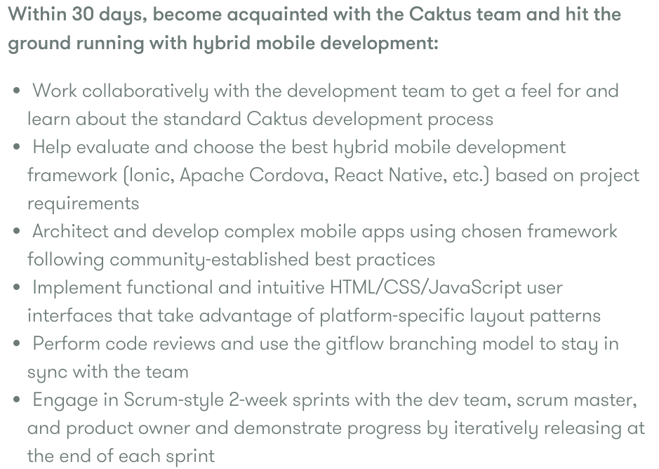

## Just be Nice
### Rethinking Tech Hiring

@@

<aside class="credit">
    <a href="https://www.flickr.com/photos/andjohan/5644714850/">
        https://www.flickr.com/photos/andjohan/5644714850/
    </a>
</aside>

Notes:
The process of hiring often starts with a job description. While this seems
straight forward, how many of you have ever read a job posting like this one.

@@

Notes:
This is a seeming endless checklist of requirements. C#, .NET, Cloud/Saas,
Node.JS, Java, Python.
REST, Asynchrony (I guess because of Node.JS), Lead Election, Zoo Keeper, HBase,
Hadoop, Machine Learning.
It reads like a combination of 4 Ph.D. thesis abstracts mashed together.
Oh but it only requires 2 years of experience.

In a similar vein but with a different tone, you'll see people looking for
rockstars, wizards, ninjas, and gurus with super vague requirements on what
you need to know or what you'll do.

https://careers.stackoverflow.com/jobs/95745/software-developer-saas-osisoft

@@

## Pace of Technology

<aside class="credit">
    <a href="https://twitter.com/pjking07/status/651484142429822976">
        https://twitter.com/pjking07/status/651484142429822976
    </a>
</aside>

Notes:
Technologies are constantly changing and what people learn in university
courses tend to be out of line with many current startups and companies.
When we hire we need people that know how to learn and adapt as things change.

@@

## Developer Shortage

<aside class="credit">
    <a href="https://www.flickr.com/photos/zabowski/2074752215/">
        https://www.flickr.com/photos/zabowski/2074752215/
    </a>
</aside>

Notes:
In a recent survey, 760 employers were polled in the US and Cananda and 83% reported
a shortage of software developers, mostly due to lack of qualified candidates.
With requirements like that previous slide, that shouldn't surprise anyone.
But it's not going to get any better from here.
The department of labor stats expects that the number of software development
jobs will grow 22% from 2012 to 2022, which is much faster than average.

@@

## Diversity in Tech Sucks

<aside class="credit">
    <a href="https://www.flickr.com/photos/hjmediastudios/7883634326/">
        https://www.flickr.com/photos/hjmediastudios/7883634326/
    </a>
</aside>

Notes:
At the same time, we have huge diversity problem in this industry. That leaves
a huge untapped resource of brilliant minds which have been excluded from entering
our industry or leave in droves after a few years. While making our industry
more diverse can't necessary solve this developer shortage, companies which can
be inclusive in how they hire have an advantage in staffing development positions.

@@

## Hi! My Name is Mark

<aside class="credit">
    <a href="https://www.flickr.com/photos/caktusgroup/15215244503/">
        https://www.flickr.com/photos/caktusgroup/15215244503/
    </a>
</aside>

Notes:
Hi! My name is Mark Lavin and I'm here to talk about a friendly approach to technical
hiring to increase diversity and build better teams.

@@

## Caktus Group

<aside class="credit">
    <a href="https://www.flickr.com/photos/caktusgroup/22023465685/">
        https://www.flickr.com/photos/caktusgroup/22023465685/
    </a>
</aside>

Notes:
I work at Caktus Group in nearby Durham, NC as the Technical Director.
I split my time between technical management/recruitment and web development.
What do I think is special about Caktus? Well first a little more about us.

@@

<aside class="credit">
    <a href="https://www.caktusgroup.com/about/">
        https://www.caktusgroup.com/about/
    </a>
</aside>

Notes:
At roughly 30 employees, we are the largest Django-specific development firm in the US.
So we are big for what we are but not a big company by most definitions.
We did an internal survey back in July and at that time, 63% of our development
staff had a non-computer science degree. Many have related degrees in engineering
fields but we also have trained opera singers, painters, and tap dancers on
our development staff.

We hire 3-4 developers each year which again isn't very many, but a because we
are small a bad hire for us is very costly.

@@

## Our Process

<aside class="credit">
    <a href="https://www.flickr.com/photos/ideonexus/3321308066/">
        https://www.flickr.com/photos/ideonexus/3321308066/
    </a>
</aside>

Notes:
So those are some of the results, but I'm here to talk about the process.
I want to preface this by saying many of these ideas aren't mine.
This process has evolved from founders at Caktus who hired me.
We've also taken to heart resources from the Ada Iniative,
Geek Feminism Wiki, Model View Culture, among others. I'll have some of those
resources linked at the end.

@@

## What is Nice?

<aside class="credit">
    <a href="https://www.flickr.com/photos/tappnel/5798812875/">
        https://www.flickr.com/photos/tappnel/5798812875/
    </a>
</aside>

Notes:
Nice doesn't mean lowering standards. Nice hiring is about injecting humanity
back into a process where it is currently lacking.
For a small company like ours, the hiring process can be the first real engagement
that a person has with us. The basic math is that most of the people we interview
aren't going to be hired by us but we'd still like them to have a positive impression
of us. You never know how your paths might cross again.

@@

## Hiring is Risky

<aside class="credit">
    <a href="https://www.flickr.com/photos/zunami/3160114349/">
        https://www.flickr.com/photos/zunami/3160114349/
    </a>
</aside>

Notes:
Hiring someone new is a fun challenge. Selecting the wrong candidate can be costly
in terms of team productivity and moral beyond the lost time and money. One of
the goals of the hiring/screening process is to limit that risk. It's my feeling
that traditional technical interviewing and hiring practices focus on finding
the "best" candidates for some twisted version of "best". Ours focuses more
on limiting unknowns so that we know what to expect from the candidates in
the first week, month, 6 months and year after they are hired.

@@

> The trouble with the world is that the stupid are cocksure and the intelligent are full of doubt.

<cite>Bertrand Russell</cite>

Notes:
Part of the challenge is that people are generally terrible at estimating their own skill.
Research calls this the Dunning–Kruger effect. When you have job descriptions with
outrageous requirements, that means people who are qualified are likely to think they
aren't and the people who aren't qualified will apply.

@@

## Performance Profiles

<aside class="credit">
    <a href="https://www.caktusgroup.com/careers/#op-84856-hybrid-mobile-developer">
        https://www.caktusgroup.com/careers/#op-84856-hybrid-mobile-developer
    </a>
</aside>

Notes:
We don't hire rockstars or ninjas and we don't have huge checklists of requirements.
We build job descriptions out of a formulated performance profile. It doesn't
list what you need to know to apply. It lists what you will do and when you
were here along with the timeline of the first 90 days of work. While these
can get technology buzzword heavy, they again hightlight what you will do, not
what you already know. What will you do: Work collaboratively, Help evaluate,
Architect and develop, Implement, Code review.

These reflect not only what we need in terms of skills but also what it's like
to work here. Hopefully in reading it candidates can begin to see themselves working
with us. Also the process of creating these profiles informs the hiring team:
what is it exactly that we want this person to do when they are here?

@@

## Screenings

<aside class="credit">
    <a href="https://www.flickr.com/photos/mrgranito/4527639541/">
        https://www.flickr.com/photos/mrgranito/4527639541/
    </a>
</aside>

Notes:
As with everyone, we look through resumes and cover letters which are submitted
through our application form. We ask for links to open source work, which is
nice but not required. If it isn't provided we'll typically still search for
it. We aren't looking for particular degrees or experience, just something which
makes us believe that they could be effective working here. A well formulated
cover letter should detail why the applicant feels that they are a good fit.

Phone screens is an optional part of our hiring workflow. It's typically reserved for
people we are on the fence about or non-local candidates. Here we want answers
to the questions we had when looking at the materials they provided.

@@

## In Person Interviews

<aside class="credit">
    <a href="https://www.flickr.com/photos/sepblog/3676361977/">
        https://www.flickr.com/photos/sepblog/3676361977/
    </a>
</aside>

Notes:
Here is where the hard work happens and I feel like we set ourselves apart.
Our in person interviews are structured like conversations. The questions
we have are a starting point but we allow the candidates to highlight the
projects and accomplishments that the candidates are proud of.

@@

## Process Not Code

<aside class="credit">
    <a href="https://www.flickr.com/photos/morville/3220961846/">
        https://www.flickr.com/photos/morville/3220961846/
    </a>
</aside>

Notes:
When it comes to more development questions, we focus on process rather than
code. We want to know how problems were solved and new things were learnt.
How were things handled when it didn't go well. Who did they work with?
How was work divided? How was testing done? Branching? Deployment?
Code review?

@@

<aside class="credit">
    <a href="https://www.flickr.com/photos/cgpgrey/5023794412/">
        https://www.flickr.com/photos/cgpgrey/5023794412/
    </a>
</aside>

Notes:
It isn't again so much that their experience/workflow matches ours but we want
to know where there are differences. What is this person going to need to learn
to be a part of our team? And also, what experience will they add to our
team when they are here?

@@

## No Whiteboards

<aside class="credit">
    <a href="https://twitter.com/mcclure111/status/644602097086951424">
        https://twitter.com/mcclure111/status/644602097086951424
    </a>
</aside>

Notes:
We do not ask deeply technical questions nor do we ask people to write code
during their interviews. We don't ask for sample projects. Again we do look
at open source code if it's available but it isn't a hard requirement. Coding
in interviews and sample projects need to stop. They are meant to be objective
but they aren't. They reenforce imposter syndrome.

@@

## Reflection of the Work

<aside class="credit">
    <a href="https://twitter.com/CaktusGroup/status/613772326065295360">
        https://twitter.com/CaktusGroup/status/613772326065295360
    </a>
</aside>

Notes:
Most importantly they aren't reflective of the work we do. We have not once locked
an employee in a room with no internet and asked them to code a depth-first search.
This isn't a skill we need. We need to know how the candidates will function
on a team, our team in particular. Make your questions a reflection of that.

@@

## Allow People to Surprise You

<aside class="credit">
    <a href="https://www.flickr.com/photos/jetbody/3281743658/">
        https://www.flickr.com/photos/jetbody/3281743658/
    </a>
</aside>

Notes:
Our interview questions focus on a topic they candidates should know very well: themselves.
We let them highlight the work they are proud of and use that as the starting point
for our conversations. We've had candidates with thin resumes come in a wow us
with amazing experience. We've also had candidates with stellar resumes who don't
seem to have a development process at all, almost as if they code entirely by
accident.

@@

## Most People are Average

<aside class="credit">
    <a href="https://www.flickr.com/photos/asiaticleague/15638419215/">
        https://www.flickr.com/photos/asiaticleague/15638419215/
    </a>
</aside>

Notes:
Most people are average and that's ok. Again our focus isn't about finding the
"best" programmer. It's about finding someone how can contribute to our team.
Someone who has something to add. We look for people who are self-aware about
their own ability and can articulate what they know and what they don't know.
Our skills and backgrounds need to complement each other. This builds a team
stronger than its individual parts.

@@

## Open Work

<aside class="credit">
    <a href="https://www.flickr.com/photos/mrsdalloway/73002012/">
        https://www.flickr.com/photos/mrsdalloway/73002012/
    </a>
</aside>

Notes:
I really love our hiring style and we've have a number of complements on it
from both candidates and other organizations. But it isn't perfect. Not everyone
is great at marketing themselves and they struggle to talk about themselves.
Those candidates struggle in this type of interview and we've probably passed
on good people because of it. There are also biases which we haven't addressed
which can come into play at the resume screening, such as just being able to
see people's names and guess their gender.

@@

## Just be Nice

<aside class="credit">
    <a href="https://www.flickr.com/photos/caktusgroup/21835294520/">
        https://www.flickr.com/photos/caktusgroup/21835294520/
    </a>
</aside>

Notes:
While I think what we do is different it isn't unique. Like our developement process,
we constantly iterate on it. We look at what others are doing as a way to improve.
It's this industries hero worship of lone developers that has us chasing "rock stars" and forcing people
to constantly "prove" themselves in interviews. Let's take a breath, learn to be
nice. Treat each other like reasonable and competent people by default instead.
Going down that route I'm sure we'll see our teams grow to be more diverse, more
creative, and more productive.

@@

## On the Shoulders of Giants

- http://geekfeminism.wikia.com/wiki/Category:For_employers
- https://modelviewculture.com/pieces/technical-interviews-are-bullshit
- https://medium.com/buffer-posts/why-we-dont-ask-technical-questions-for-technical-interviews-at-buffer-73f8132a8abd
- https://www.recruiter.com/i/4-types-of-interviewer-bias-and-how-to-eliminate-them/
- http://www.phoenix.edu/news/releases/2015/02/research-shows-employers-struggle-with-shortage-in-software-development-talent.html

Notes:
We certainly wouldn't be where we are without resources like these. If what I'm
saying is starting to make sense to you, please read on.

@@

## Thanks!

http://talks.caktusgroup.com/all-things-open/2015/hiring/

### We're Hiring!

https://www.caktusgroup.com/careers/