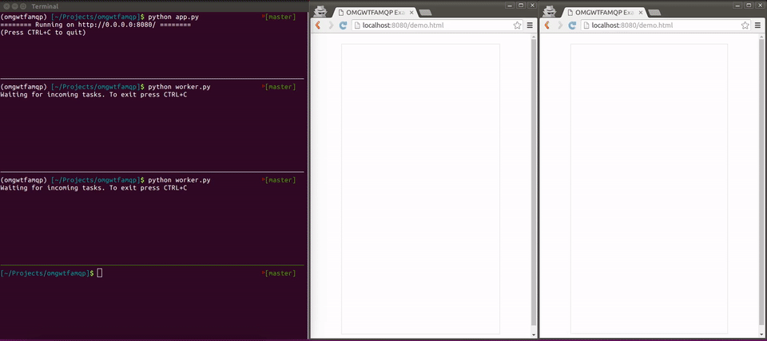

## OMGWTFAMQP

Notes:
Thank you everyone for coming to my talk with a silly and not particularly discriptive name.
My name is Mark Lavin and I work at Caktus Group. We're a consultancy focused on custom
web applications built using Python and Django. I'm the co-author of the book
"Lightweight Django" for O'Reilly Media and I also recorded a video series for
O'Reilly called "Intermediate Django". So while I'm typically talking about my
work in the Django community I'm not going to be talking about that today.

@@

## Advanced Message Queuing Protocol

Notes:
Today I'm going to be talking about AMQP which stands for Advanced Message Queuing Protocol.
If you thought that this talk would be equally silly as the title I will do my best but
I also want this to be a practical introduction to AMQP.
We aren't going to be looking at this on the wire-protocol level. Most languages have client
libraries for talking with AMQP servers and you should use one of them.
Instead we are going to be looking at how you can use it in your applications.
Getting through the terminology and concepts. My goal today is to give a base for
future learning and research.

@@

## Who?

Notes:
AMQP was born out of the financial services industry in JP Morgan Chase in 2003. The
most commonly used version of the specification 0-9-1 was released in late 2008
while the 1.0 standard was finalized in 2012. It's been used in a number of high-throughput
and low latency applications and battle tested over the years.

@@

## What?

Notes:
It's an open standard for message passing between applications. Client applications connect
through an AMQP based intermediary server and are able to pass messages using a number
of different communication patterns. We are going to look at a few of them today.
The specification allows for tuning delivery guarentees with speed/latency to suit
a number of different use cases.

@@

## Why?

Notes:
Why would you want to use something like AMQP? That's a great question. Asynchronous
message passing is one way to build distributed applications or the new hottest
of "micro-services". In this type of architecture you have applications talking
to one another by sending messages through an intermediate broker server/cluster.
Applications can listen to the streams that they care about without knowing anything
about where the messages are coming from and likewise can publish messages without
needing to wait for a response or worrying if it can be immediately handled.
In that way the AMQP broker is handling service discovery. This has some advantages
over how you might build interconnected services with HTTP based APIs or rolling
your own wire protocols for inter-application communication.

@@

## How?

Notes:
There are a couple choices for open-source AMQP servers, the most popular of which
is RabbitMQ. It supports version 0-9-1 by default and 1.0 can be enabled by an extension.
It also has a few protocol extensions. My examples will use RabbitMQ because that's
what I'm most familiar with and we'll touch on some of the protocol extensions because
I think they're awesome.

As noted there are client bindings (for your application) in most languages. My
examples are in Python because it's easy to read and the language that I use
everyday at Caktus Group.

@@

## Terminology

Notes:
Again my goal today isn't for you to understand the bytes that go over the wire
but instead to understand how to use AMQP for your applications. With that there
is a fair bit of terminology and many of the client libraries share this terms.
Going through this will help you understand how to pick up a library and start
putting the pieces together.

@@

An AMQP server acts as a ***broker*** between message ***producers*** and ***consumers***.

Notes:
In your application archicture you would say that the AMQP server (like RabbitMQ)
is the broker between your applications (or within the same application). Some
application with publish messages and they would be considered producers. Other
applications read messages and those would be considerd message consumers.

@@

Messages are published to ***exchanges*** bound to a connection ***channel***.

Notes:
Applications establish a TCP connection to the broker and then create one or
more channels or virtual connections. Channels handle sending commands to the
server and an application many create multiple channels per connection. Often
multi-threaded applications will create a channel per thread which all share
a single connection to the server.

@@

Messages are routed through exchanges to consumer ***queues*** based
on the message ***routing key*** and the queue ***binding key***.

Notes:
Like the publishing exchanges, each queue is bound to to a connection through
a channel.
How these are routed is based on the exchange type and the message routing
information. The end result is that a published messages might be sent to 0 or
more queues.

You can also have exchange to exchange binding for complex routing cases but in
the end for a message to get to a consumer it needs to go to a queue.

@@

Messages are ***acknowledged*** by consumer applications.

Notes:
Messages represent state being passed between the producer and consumer. The broker
is in charge of handling that state until the message has been acknowledged. Then
the broker is free to forget about the message. Your applications should not
acknowledge messages until the state has been captured and transfered to the
receiving application.

Immedidately acknowlegding messages effectively makes their delivery at most once.
For durable queues, late acknowledgement of the messages means they will be delivered at
least once (maybe more than once).

@@

To avoid roundtrips to the server, consumers can adjust their ***quality of service (QoS)***
to prefetch multiple messages at once.

Notes:
This is where the acknowledgement can come into play particularly when there are
unexpected failures.
This is a trade-off balancing latency to process messages and the fairness in how
they are distributed over multiple consumers. If messages are coming in very quickly
and they can be processed quickly then it can help your application to prefetch messages.
If you don't have a high volumne of message or they take a long time to process, you
are likely better off without prefetching.

@@

A ***direct*** exchange routes messages to queues based on an exact match of the
routing key and the binding key.

Notes:
The default exchange is a direct exchange.
This is the typical exchange for a task queue. One way to do this would be
to have each type of task in its own queue and consumers would pull messages
from the queues to process the work.

@@

A ***fanout*** exchange routes each message to all of the queues bound to the
exchange.

Notes:
On the other end of the spectrum, fanout exchanges ignore the routing key
used by the message. For using fanout exchanges, each consumer needs to create its own queue.
Any type of global application broadcast might use a fanout exchange.

@@

A ***topic*** exchange routes messages to queues based on topic patterns
in the routing key and the binding key.

Notes:
A nice in-between is a topic exchange. This allows for selective pub/sub.
The routing keys for topic messages need to be delimited by dots/periods. The
binding keys for topic exchanges can contain wild cards for either single "word"
matches or multiple words.

@@

## Take a Deep Breath


Notes:
That was a lot to absorb in the abstract so we are going to start diving into
an example application. It's written in Python which makes it fairly readable.
I hope that it will be helpful to people who don't normally use or read Python.

@@

## What To Build


Notes:
We are going to build a general purpose webhook reciever. It's going to take
webhook message from a fake service and translate them into AMQP messages to be handled
by a build/task/worker server.

We'll also have a websocket handler which give live updates of incoming jobs,
when they've started and when they've completed with their status. Hopefully
this looks something like you've built before or maybe thought about building.

@@

## Reciever (app.py)

```python
import asyncio
import aioamqp
from aiohttp import web
...
app = web.Application()
app.router.add_post('/', hook)

async def connect():
    app['transport'], app['connection'] = await aioamqp.connect()
    channel = await app['connection'].channel()
    await channel.exchange(exchange_name='omg', type_name='topic')

async def cleanup(app):
    await app['connection'].close(timeout=1.0)
    app['transport'].close()

def main():
    app.on_shutdown.append(cleanup)
    loop = asyncio.get_event_loop()
    loop.run_until_complete(connect())
    web.run_app(app)

if __name__ == '__main__':
    main()
```

Notes:
As I mentioned for this example I'm using Python and in this case I'm using
3.5 and my examples use the recent asycnio module. The web side of this code
uses aiohttp. That's not a requirement of AMQP but it is what I've choosen to
do here.

This is the skeleton of our web application which takes an incoming web hook as
a POST to the server root. We'll look at that webhook callback on the next slide.
Here we can see the first bit of AMQP interaction: when the server starts we
open a shared connection and declare the topic exchange that we are going to
use for our messaging call OMG. When the server is shut down then that connection
is closed.


## Reciever (app.py) Cont...

```python
...
import json
import uuid
...
async def hook(request):
    data = await request.post()
    project = data.get('project', None)
    user = data.get('user', None)
    if not (project and user):
        raise web.HTTPBadRequest()

    channel = await request.app['connection'].channel()
    routing_key = 'incoming.{project}.{user}'.format(project=project, user=user)
    message = json.dumps({
        'project': project,
        'user': user,
        'status': 'incoming',
        'uid': uuid.uuid4().hex,
    })
    await channel.publish(message, exchange_name='omg', routing_key=routing_key)
    return web.Response(text='OK')
```

Notes:
Now we're looking at the web hook code itself. Recall that we are only routing
POST requests to the endpoint. The first thing it does is try to pull two
variables out of the POST: user and project. Obviously this could use more
validation but for brevity just check that they are non-empty. The routing
key is incoming.project.user. We construct a small JSON encoded message and
broadcast it over the exchange. Then we send back a 200 response.

@@

## Task Queue (worker.py)

```python
import asyncio
import aioamqp
...

async def receive():
    transport, connection = await aioamqp.connect()
    channel = await connection.channel()
    await channel.exchange(exchange_name='omg', type_name='topic')
    await channel.queue(queue_name='omg.tasks')
    await channel.queue_bind(exchange_name='omg', queue_name='omg.tasks', routing_key='incoming.#')
    print('Waiting for incoming tasks. To exit press CTRL+C')
    await channel.basic_consume(callback, queue_name='omg.tasks')

loop = asyncio.get_event_loop()
loop.run_until_complete(receive())
loop.run_forever()
```

Notes:
This is the setup for our task worker. It connects to the local AMQP server and opens a new
channel. It declares the same 'omg' exchange and binds a new queue to it called 'omg.tasks'.
That queue is getting topic messages where the first word is incoming which is how they are
published from the webhook. This could be configured to only listen for particular projects
or particular users by changing the routing key. Then it starts a new consumer on that queue.

Note we don't have to declare the exchange twice but you need to be sure that the exchange exists
before binding the queue to it so it doesn't hurt to have it in both places.


## Task Queue (worker.py) Cont...

```python
...
import json
import random

async def callback(channel, body, envelope, properties):
    data = json.loads(body.decode('utf-8'))
    routing_key = 'build.{project}.{user}'.format(**data)
    print('Task for {project}/{user} started...'.format(**data))
    update = data.copy()
    update['status'] = 'started'
    await channel.publish(json.dumps(update), exchange_name='omg', routing_key=routing_key)

    await asyncio.sleep(random.random() * 10)
    if random.random() < 0.90:
        print('Task for {project}/{user} passed!'.format(**data))
        update['status'] = 'succeeded'
    else:
        print('Task for {project}/{user} failed.'.format(**data))
        update['status'] = 'failed'
    await channel.publish(json.dumps(update), exchange_name='omg', routing_key=routing_key)
    await channel.basic_client_ack(delivery_tag=envelope.delivery_tag)
```

Notes:
This is the consumer callback continuing from the previous setup. This is called for every
new message that the consumer recieves. It deserializes the message and builds a routing
key for publishing updates. It publishes a message when the task has started and then when
it is complete with either a success or failure. For fun that is completely random but it
is successful most of the time. Once all the work is done it acks the message.

Now there are a number of edge cases which are ignored here like what happens if the message
isn't value JSON or doesn't have the keys we expect. Production code would need to handle those
types of cases but for simplicity and to fit them on the slide they are not handled here.

@@

## Websocket (app.py) Cont...

```python
import os
...

app = web.Application()
app.router.add_post('/', hook)
app.router.add_get('/socket', socket)
app.router.add_static('/', os.path.join(os.path.dirname(__file__), 'public'))
```

Notes:
Adding some new routes to serve static content (an HTML page, CSS, and JS file). For brevity
I'm not going to show the HTML/CSS/JS. I'll have a link to the repo with all of this
example code. The JS just takes each message and sticks it into the DOM.
Here we also have a new route for the websocket which we're going to look at right now.


## Websocket (app.py) Cont...

```python
from aiohttp import WSMsgType
...
async def socket(request):
    ws = web.WebSocketResponse()
    await ws.prepare(request)

    channel = await request.app['connection'].channel()
    result = await channel.queue_declare('', exclusive=True)
    await channel.queue_bind(exchange_name='omg', queue_name=result['queue'], routing_key='#')

    async def message(channel, body, envelope, properties):
        if not ws.closed:
            ws.send_str(body.decode('utf-8'))
        await channel.basic_client_ack(envelope.delivery_tag)

    await channel.basic_consume(message, queue_name=result['queue'])

    async for msg in ws:
        if msg.type != WSMsgType.TEXT:
            break
    await channel.close()
    return ws
```

Notes:
This doesn't read any of the messages from the socket. It only pushes new messages to
the browser. When the browser closes the websocket closes the channel which destroys the
queue.

@@

## Putting It All Together


Notes:
Finally it's time to see it all working together. I'm not going to do a live demo because
I've spoken enough times to know how bad an idea that can be. Instead I have some screenshots
and recordings so you're going to have to trust that this does in fact work as I claim that it does.
If you came to see a train wreck then sorry to disappoint you.


## Running the Server

```bash
$ python app.py
======== Running on http://0.0.0.0:8080/ ========
(Press CTRL+C to quit)
```

Notes:
First we'll fire up the webserver. Recall that this runs both the webhook reciever and the
websocket endpoint. However those could be completely seperate web applications. Remember
that the interaction all happens over the AMQP server. So for instance my web framework
of choice is Django but it doesn't support websockets. I could have a Django application
which handles the webhook and a different server using asyncio (like this one) or Node or
Erlang for the websocket. AMQP gives us that flexibility.

In any case the server is listening on localhost 8080.


## Running the Worker

```bash
$ python worker.py
Waiting for incoming tasks. To exit press CTRL+C
```

Notes:
Here were are going to spin up a few workers. They are each consuming from the same
queue so the messages should round-robin between them assuming that they are available
to pick up more work.


## Triggering the Webhook

```bash
$ curl -X POST -d project=omg -d user=mlavin http://localhost:8080/
Ok
```

Notes:
Now we are going to trigger the webhook by POSTing to the endpoint with curl. Here's
an example of how that would be done. Remember that both the project name and user name
are required in the POST but to don't really validate them anymore than that they are
given and that they are not blank.

We'll hit it a number of times in a row to see how the workers process the incoming messages.


## Demo



Notes:
Here's a recorded demo of this all working together. You can see we are running the web
server on the top and two workers below that. In the bottom pane we are using curl to
trigger the webhook. There are two browsers which you can see are getting live updates.

Note the difference in that the worker messages only go to one of the workers but both
websockets get all of the messages. This is again because the workers are consuming off
of a shared queue while the websockets each have their own unique queue.

@@

## AMQP Extensions

- Reply To Queue
- Consumer/Message Priority
- Queue/Message TTL
- Dead Letter
- Queue Length Limits
- Exchange to Exchange Bindings

Notes:
Again this is just an introduction and there is plenty more to look into. Beyond
the protocol pieces we've talked about today there are also extensions to the
specification: reply-to for doing RPC calls over AMQP, Consumer and message priorities,
TTL/expiry along with dead letter exchanges, limiting queue lengths, and exchange
to exchange bindings for even more flexible message routing options.

If you take anything away from this talk it should be, please don't invent your
own messaging protocol. AMQP and RabbitMQ is more robust and featured than you
can imagine.

@@

## Resources

- [RabbitMQ Tutorial](http://www.rabbitmq.com/getstarted.html)
- [RabbitMQ Cookbook](http://shop.oreilly.com/product/9781849516501.do)

Notes:
Some resources again to get you diving in, RabbitMQ has a great tutorial going through
the different exchange types and message patterns. It's available in a few different
programming languages: Python, Java, Ruby, PHP, C#, JS, Go, Elixir, Obj-C

Packt Publishing also has a cookbook on using RabbitMQ.

Remember that an advantage of using an AMQP broker is the iteroperability so while
these resources are for RabbitMQ, many of the concepts and examples will transfer to
another broker.

@@

## Thanks!

- Slides: http://talks.caktusgroup.com/all-things-open/2016/omgwtfamqp/
- Example Code: https://github.com/mlavin/omgwtfamqp/

Notes:
Thank you again for your attention and I hope there was something helpful for you today.
Again my name is Mark Lavin and I work for Caktus Group. If you need some custom
web development in Python using Django then please hire us.
