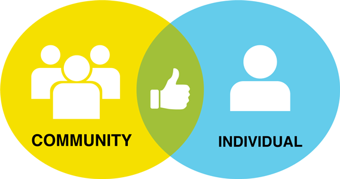
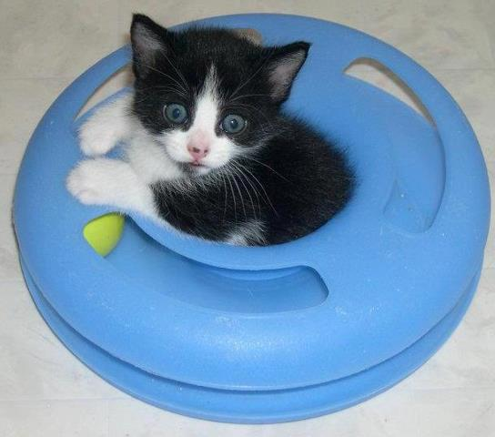
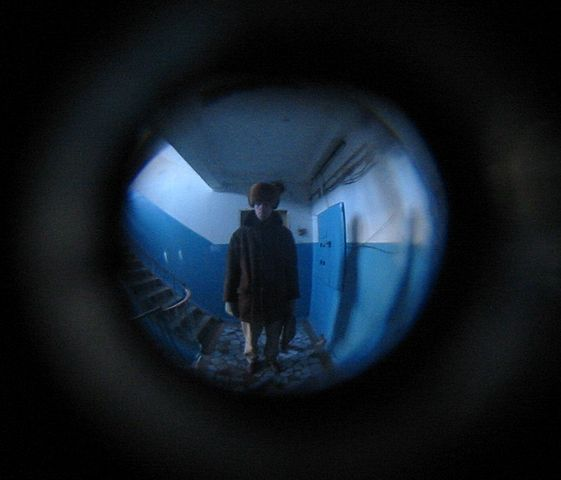
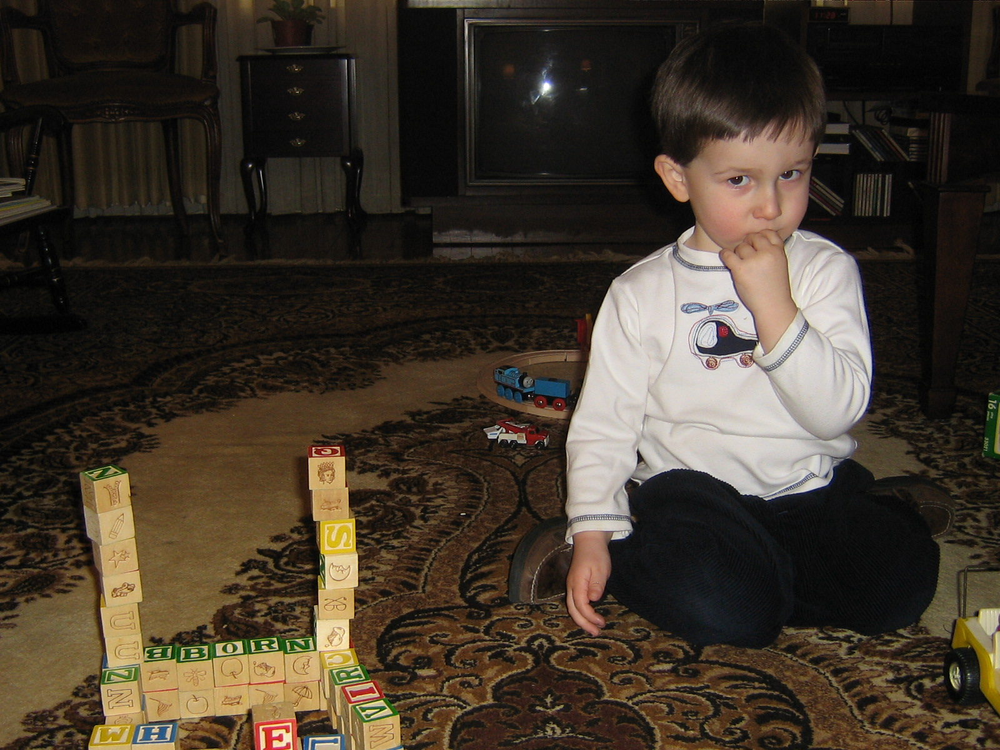
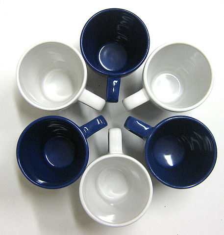
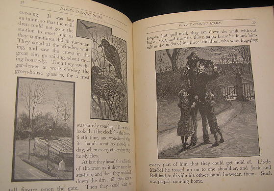
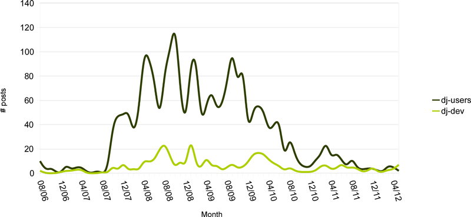

Fostering Community
===================

Karen Tracey

DjangoCon Europe 2012

----

Why?
----

- Django's community is one of its greatest assets
- Everyone can contribute
- Everyone can benefit

# Presenter Notes

- Address "Why should I bother?" question
- Participation is not one-way
- Goal: inspire people to get involved

----

Who am I?
=========

----

Programmer since forever
----

----

Crossword puzzle constructor since 2001
---------------------------------------

----

Cat rescuer since 2009
----------------------

----

My Django story begins in 2006
-------------------------------

- Django open-sourced a year earlier
- 0.95 just released, "dozens of contributors"
- Five core developers

----

Puzzle database
---------------

- Aid in constructing puzzles, accessible from construction tool
- Amassed over ~5 years
- ~5,000 puzzles, ~100,000 unique entries, ~500,000 clues

----

Problem: limited access to data
-------------------------------

----

Project: web front-end for database
-----------------------------------

- Primary goal: better ability to "see" data
- Secondary goal: learn Python

----

Survey: Python web frameworks
-----------------------------

- Django?
- Turbogears?
- Pylons?

----

----

Snag: my weird database
-----------------------

    !python
    class Entrie(models.Model):
        Entry ID = models.IntegerField(primary_key=True)
        Entry = models.CharField(blank=True, unique=True, maxlength=150)
        class Meta:
            db_table = 'Entries'

# Presenter notes
Database introspection produced

----

Concern
===============================

# Presenter Notes
Is my database fundamentally flawed for use by Django?

----

django-users to the rescue!
---------------------------

# Presenter Notes
- Posted question ~8PM
- Malcolm answered ~9PM
- Adrian follow-up 2 days later on "unpluralize" fix

----

My first ticket and patch
-------------------------

- Ticket #2517 opened 9:53:14AM
- 4-line patch
- Patch, 50% modified, committed by Adrian at 9:58:27AM
- Name added to AUTHORS

----

----

Sadness
-------

- Probably never happens today
- Needs test!
- Balance stability with wow-factor

----

Github to the rescue?
---------------------

-----

Back to the mailing list post
-----------------------------

- Hesitant to sign my name
- Open source has bad rep w.r.t treatment of women
- Confident of technical ability
- ...but conscious I didn't know much about web programming
- Would I get more respect if I didn't reveal my name?

----

Plea: encourage women
---------------------

- Women actively discouraged from participating in open source communities
- Please don't join in bad behavior
- Speak out against it when you see it

----

Yes, we need more women
-----------------------

----

Back to my story...
-------------------

----

My mailing list participation
-----------------------------

----

Why did I become so active?
---------------------------

- Learn more about Django
- Improve communication skills
- Help people
- Puzzles!
- Long-range goal: get a job

----

What did Django community gain?
-------------------------------

- Lots of triage/bugfixes prior to 1.0
- Some features/bugfixes since 1.0
- Helped many people learn Django

----

What did I gain?
----------------

- Became core committer in 2008
- Asked to write a book in 2009 (published 2010)
- Got a great job in 2010

# Presenter Notes
(No, I was not in a hurry...)

----

Get involved!
-------------

(You already are)
-----------------

- Community events, big or small
- Mailing lists
- IRC
- Stack overflow
- Ticket triage
- Bug fixes
- Feature development
- Patch review
- Blogs

----

Image credits
-------------

- Venn Diagram: "User" and "Community", from The Noun Project collection
- IBM PC: http://commons.wikimedia.org/wiki/File:IBM_PC_5150.jpg
- Helicopter rescue: http://commons.wikimedia.org/wiki/File:Rescue.jpg
- Fireworks: http://commons.wikimedia.org/wiki/File:OperaSydney-Fuegos2006-342289398.jpg
- Mask: http://commons.wikimedia.org/wiki/File:Doctor-0001.jpg
- Superman Octocat: http://octodex.github.com/images/okal-eltocat.jpg, by Cameron Mcefee
- Coffee cups #1: http://commons.wikimedia.org/wiki/File:Discrimination-Diversity-01.jpg
- Coffee cups #2: http://commons.wikimedia.org/wiki/File:Discrimination-Diversity-02.jpg
- Story book: http://commons.wikimedia.org/wiki/File:Chatterwell_Stories_3.jpg
- Sprout, from The Noun Project
- Liftoff: http://commons.wikimedia.org/wiki/File:1994_s64_Liftoff.jpg
- Teaching: http://commons.wikimedia.org/wiki/File:Alice_Hamilton_in_an_anatomy_class.jpg
- Others my own

