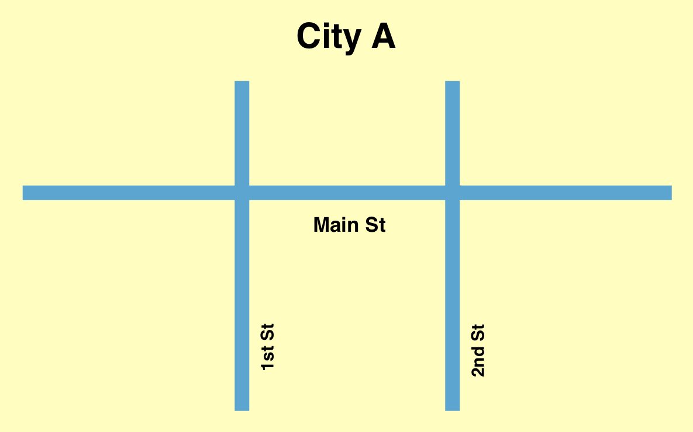
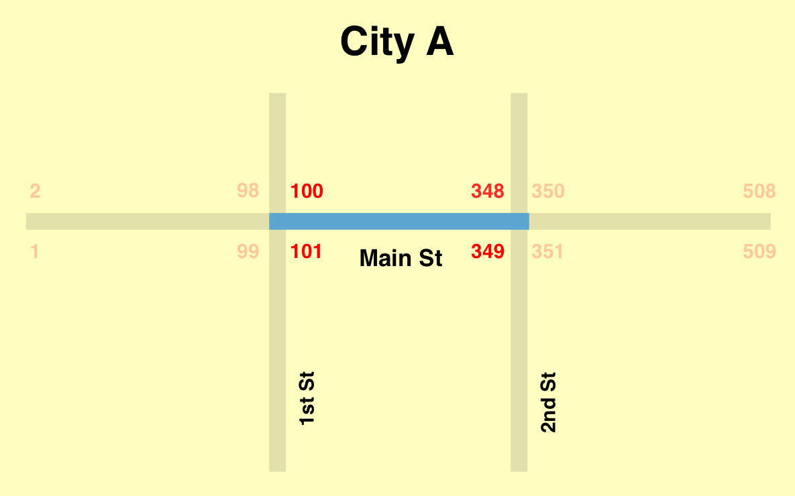
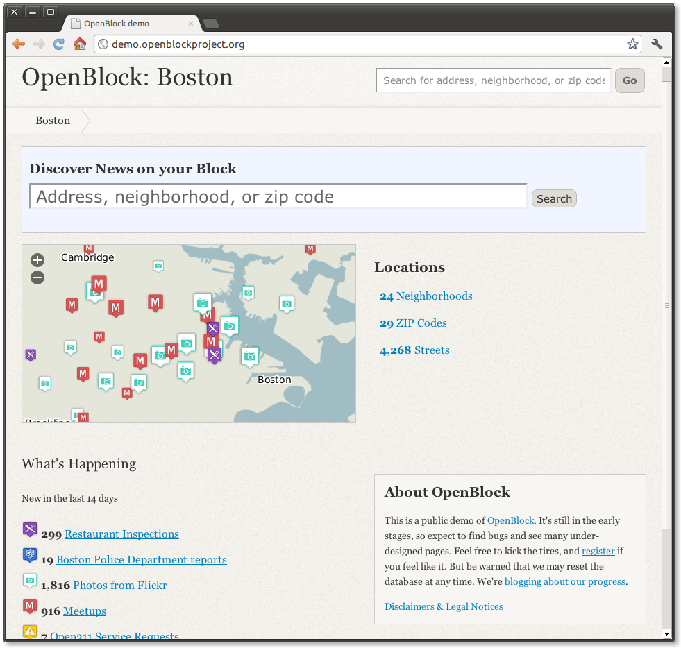
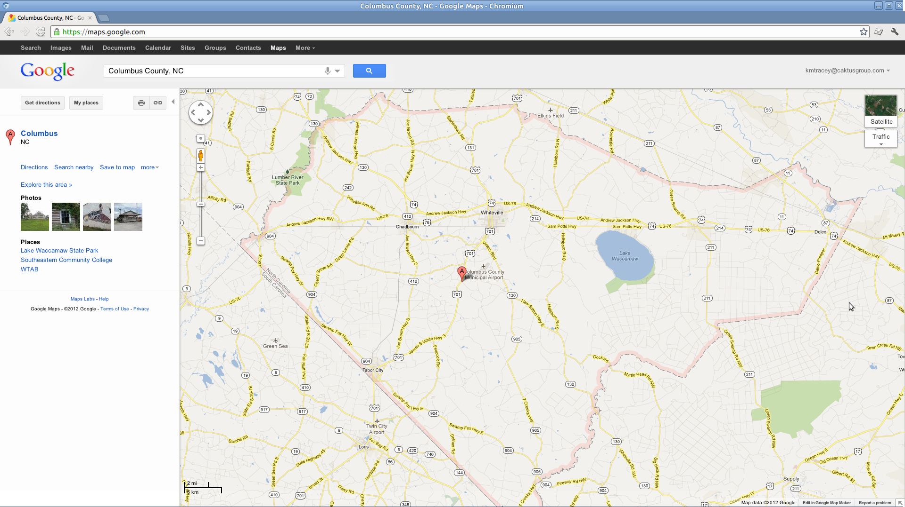
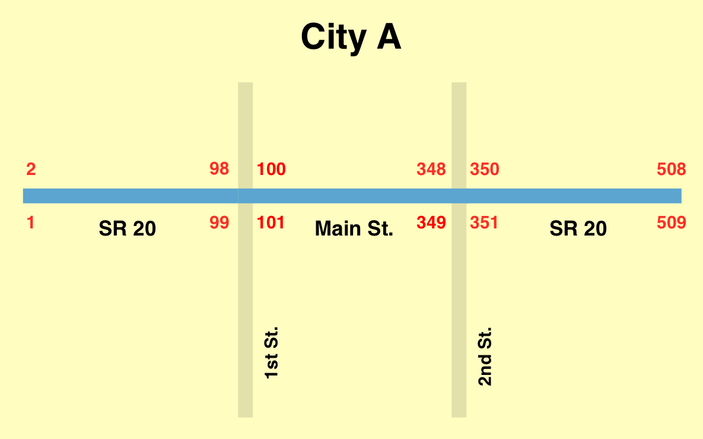
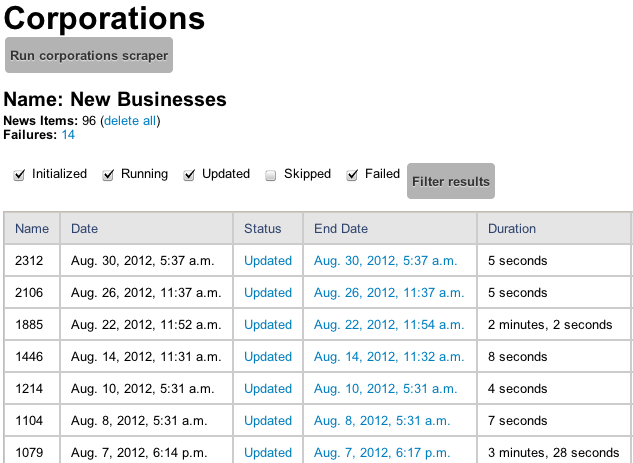

=========
OpenBlock
=========

-----------------------------
Overview & Initial Experience
-----------------------------

Karen Tracey, Colin Copeland

----

Talk Outline
============

- What it is?
- Our experience with it
- Extensions inspired by our experience
- Future

----

Introduction
============

----

What is OpenBlock?
------------------

- "Hyper-local news" application framework

- Example news types

  - police incident reports
  - property transactions
  - restaurant inspections
  - business registrations

- Open source project

  - Web site: http://openblockproject.org/
  - Code: https://github.com/openplans/openblock
  - Mailing list: http://groups.google.com/group/ebcode/

----

What Kinds of Sites Might Use OpenBlock?
----------------------------------------

- Sites with a local focus,
- which can benefit from automated news item generation,
- where news item sources already exist online,
- in some user-unfriendly, but regular, fashion

----

OpenBlock History
=================

Presenter Notes
---------------

- Let's take a moment to learn where OpenBlock came from

----

EveryBlock.com
--------------

.. http://www.holovaty.com/writing/knight-foundation-grant/
.. http://www.knightfoundation.org/grants/20060885/

- Adrian Holovaty founded a web startup, EveryBlock, with a team of six
- **March 2007:** Won Knight News Challenge program grant
- **Jan. 2008:** Site launch with Chicago, New York, San Francisco
- **June 2008:** Charlotte and Philadelphia added
- **Aug. 2009:** Acquired by MSNBC
- Today in 16 cities, 3 more coming soon

Presenter Notes
---------------

* EveryBlock was originally funded by a two-year grant from the Knight Foundation through its Knight News Challenge program.

----

EveryBlock.com
--------------

.. image:: static/example-everyblock.png
    :width: 100%

Presenter Notes
---------------

- Browse by neighborhoods, streets, zipcodes, or draw your own location
- Lots of public record information as well as community neighbor content
- Lots of community activity, especially in Chicago

----

EveryBlock Source Code
----------------------

.. http://blog.everyblock.com/2009/jun/30/source/

- **July 2009:** the EveryBlock team open sourced core functionality on Google Code
- 7 tarballs available at http://code.google.com/p/ebcode/
- And then what happened?

Presenter Notes
---------------

- Great codebase, lots of potential, but no community around the code yet
- Hard to configure project requirements
- Code was fairly complex, hard for beginners to jump into the project

----

OpenBlock
---------

.. http://www.knightfoundation.org/press-room/press-release/knight-foundation-expands-neighborhood-news/

.. image:: static/openblock-logo.png
    :align: center

- **June 2010:** Knight Foundation launches OpenBlock Initiative grant

  - **OpenPlans:** streamline and extend OpenBlock over 2 years
  - **The Columbia Daily Tribune:** install, test, and add new features in the context of a smaller newspaper
  - **The Boston Globe:** install, test, and add new features in the context of a larger newspaper

Presenter Notes
---------------

- Limited adoption a year after being open sourced
- Very little traffic on the ebcode mailing list
- Grant goal to simplify and accelerate adoption of the open sourced EveryBlock code

----

OpenBlock Today
---------------

.. image:: static/openblock-logo.png
    :align: center

- Easier to install and setup
- Consolidated codebase into 4 core modules

  - `ebdata`
  - `ebpub`
  - `obadmin`
  - `obdemo`
- Current (v1.2) and previous versions are installable via PyPI

- **Code:** https://github.com/openplans/openblock
- **Demo site:** http://demo.openblockproject.org/
- **Documentation:** http://openblockproject.org/docs/

Presenter Notes
---------------

- Two years later, this is what OpenBlock looks like today
- Most important are ebpub and ebdata as they contain the geocoding, scraping, and display logic
- Take a moment to talk breifly about the architecture

----

OpenBlock Architecture
----------------------

.. image:: static/openblock-components.png
    :align: center
    :height: 40em

Presenter Notes
---------------

- OpenBlock architecture is comprised of 4 main components
- Touch briefly on data model

----

Data Model
----------

.. http://openblockproject.org/docs/packages/ebpub.streets.html#module-ebpub.streets.models

* Primary News Models

  * **Schema:** description of a particular data set, like "Restaurant Inspection"
  * **NewsItem:** individual piece of news associated with a schema

* Primary Geocoder Models

  * **Street:** a street with a unique name
  * **Intersection:** a point representing the meeting of two streets
  * **Block:** segment of a single street between two intersecting streets

Presenter Notes
---------------

- Highlight the most important OpenBlock models, divided into two categories
- Blocks are a fundamental piece of the OpenBlock system
- Let's look at a few diagrams to illustrate the block model

----

Example City Streets
--------------------

Presenter Notes
---------------

- Example city
- Main St divided by 1st and 2nd street

----

Street Model
------------

.. image:: static/data-model-street.png
    :width: 100 %

Presenter Notes
---------------

- Street model represents an entire street
- So you can see the entire length of Main St highlighted here

----

Block Model
-----------

Presenter Notes
---------------

- One segment of a street, including the left and right address ranges for that segment
- Blocks are a fundamental piece of the OpenBlock system
- They're core to geocoding and are browsable on the Web UI
- We'll talk more about blocks later, but I wanted to famliarize them with you now
- Now, let's look at some OpenBlock sites

----

OpenBlock Sites
===============

----

OpenBlock Demo: Boston
----------------------

Presenter Notes
---------------

- Flagship demo for OpenBlock in Boston, MA
- Ideal example for OpenBlock (large city, similar to EveryBlock)
- Very recent data, including restaurant inspections and police reports

----

openCampus Kent
---------------

.. image:: static/example-kent.png
    :width: 100%

Presenter Notes
---------------

- Kent State University in Ohio
- Simple site only using a few OpenBlock views (no detail views)
- Crime reports, reviews from Yelp, News feed from campus newspaper

----

LarryvilleKU
------------

.. image:: static/example-larryvilleku.png
    :width: 100%

Presenter Notes
---------------

- University of Kansas
- Twitter integration and accident reports
- Joint venture of the School of Journalism and the student newspaper
- Newspaper partnership is related to what we've been doing with OpenRural

----

OpenRural
=========

Presenter Notes
---------------

- Taking OpenBlock and using it in rural North Carolina communities
- Small towns and small news organizations
- Newspapers don't have a lot of digitial resources
- And they lack the resources to make public data digestible on the web
- Quite different than typical OpenBlock setup in a big city with larger infrastructure

----

OpenRural
---------

.. http://www.knightfoundation.org/grants/20110150/

.. image:: static/unc.png
    :width: 60%
    :align: center

- **June 2011:** OpenRural funded by a three-year Knight News Challenge grant
- Ryan Thornburg, professor at School of Journalism and Mass Communication at UNC
- Caktus is helping develop and deploy OpenRural for these NC communities

Presenter Notes
---------------

- Goals:

  - Apply same OpenBlock tools to rural North Carolina communities
  - Increase access to local public records
  - Do this by helping local newspapers leverage OpenBlock
  - "Help Rural Newspapers Get Access to Public Data"

----

Columbus County, North Carolina
-------------------------------

.. image:: static/nc-columbus-county.png
    :width: 100%

Presenter Notes
---------------

- Our initial focus is on Columbus County, NC
- Small county in the south eastern part of the state with 50k residents
- Working with a local newspaper to incorporate public records onto their site

----

The News Reporter
-----------------

.. image:: static/whiteville-com.png
    :width: 100%

Presenter Notes
---------------

- The online version of the paper serving Whiteville and Columbus County

----

Experiences
===========

----

Columbus County, NC
-------------------

----

Sources for Street/Block Data
-----------------------------

- Shapefiles contain location data and metadata

  - Census (Tiger)
  - County
  - State

- How to measure accuracy & completeness?

  - Columbus County GIS has addresses file
  - ~38,000 valid addresses in the county

-----

"Cities" in Columbus County
---------------------------

.. image:: static/nc-columbus-county-cities.png
    :width: 100%

----

Challenging Characteristics of Columbus County
----------------------------------------------

- Multiple "cities"

  - Supported by OpenBlock, but not "default"
  - Different urlpatterns single- vs. multi-city
  - Multi-city urlpatterns include "city slug"

- Unincorporated areas

  - Lots of space not in any town/city
  - These places need names to be navigable
  - Can use census "county subdivision" names
  - ...but these are not meaningful to residents

----

1st Approach: Census Files for OpenBlock Data
---------------------------------------------

- Advantages

  - Code already exists in OpenBlock to use these files
  - Generalizable to other NC counties

- Disadvantages

  - Incomplete/incorrect data
  - 70% success rate geocoding ~38,000 Columbus County addresses

----

Missing Addresses
-----------------

.. image:: static/bad-data-missing-addresses.png
    :width: 100 %

----

Changing Names
--------------

----

2nd Approach: County GIS Department Data
----------------------------------------

- Advantages

  - More complete/accurate
  - ~38,000 address geocode success rate improved to 93%

- Disadvantages

  - Custom code to load this data (custom BlockImporter)
  - Not generalizable to other counties
  - This data not available for all counties

----

Custom Data Availability in NC
------------------------------

.. image:: static/Street_Centerline_Download_County.jpg
    :width: 90 %

----

Geocoding is Still Difficult
----------------------------

- Geocoding is a hard problem to solve
- String parsing

  - number
  - predir
  - street name
  - street type
  - postdir

- Streets can have multiple names (misspellings table can help)
- 3rd-party geocoder fallback?

----

Scrapers
========

----

What are they?
--------------

- Scripts that extract information from online data sources

- The process is conceptually simple:

  - Download some data from the web
  - Create one or more NewsItems whose fields are populated with that data
  - Save the NewsItem(s) to the database

- The grunt work is in extracting the data you need

- Scrapers sometimes require more than a single data source

  - CSV/Excel/Navy DIF
  - Shapefile
  - Download multiple files and stitch them together locally

----

Scrapers for The News Reporter
------------------------------

- **Corporation Filings:** scraped from the NC Secretary of State website
- **Restaurant Inspections:** scraped from large Crystal Report exports from the NC Department of Health and Human Services
- **Property Transactions:** scraped from the Columbus County Tax and GIS offices
- **Geocoded News Articles:** scraped from whiteville.com

- Notably missing: police incident reports

Presenter Notes
---------------

- Working with newspaper and government staff to scrape and collect online data
- Local staff has been very helpful

----

The News Reporter: Public Records
---------------------------------

.. image:: static/whiteville-com-openrural.png
    :width: 100%

Presenter Notes
---------------

- Plan to launch production environment by Nov. 1, 2012

----

Property Transactions Scraper
-----------------------------

.. image:: static/scrapers-property.png
    :width: 80 %
    :align: center

----

OpenRural Stack
---------------

- Automated ``fabric`` server provisioning and deployment. Testable with ``vagrant``.
- Using Celery and RabbitMQ for asynchronous tasks (scrapers and maintenance tasks)
- Modified fork for OpenBlock that includes ``staticfiles`` changes.
- Production runs nginx and gunicorn on a small Amazon EC2 instance.
- Most issues fixed on OpenBlock core are pushed back to the official repository

- Everything is completely open source
- https://github.com/openrural

Presenter Notes
---------------

- Atypical OpenBlock setup
- Local development instructions are included

----

.. common problems: stale data, no community aspect

Extensions
==========

Presenter Notes
---------------

- So we've highlighted our experience and how we've used it for OpenRural
- Now we'll cover how we've extended and added features to OpenBlock
- OpenBlock handles scraping and public viewing, but is missing review and analysis

----

The Missing Piece: Data Review and Analysis
-------------------------------------------

- How successful was the geocoder?
- How many news items were added?
- Why is my scraper failing to run?
- Why did this address fail to geocode? How can I correct it?

Presenter Notes
---------------

- We found ourselves asking...

----

Data Dashboard
--------------

.. image:: static/datadashboard-list.png
    :width: 100 %

Presenter Notes
---------------

- We created what we call the Data Dashboard
- Simple extension to the OpenBlock scraper architecture
- Provides statistics related to each run

----

Data Dashboard
--------------

Presenter Notes
---------------

- Keeps track of each run for every scraper, including execution time and status
- Since this scraper runs multiple times a day, it doesn't always injest new data
- Filtered here to only show the runs that updated data
- 2 min run was a full import after resetting the NewsItems
- 5 sec run was for when it found new news items a few days later

----

Data Dashboard
--------------

.. image:: static/datadashboard-stats.png
    :width: 100 %

Presenter Notes
---------------

- High level statistics for each run
- Includes geocoding exceptions
- Support for custom counters
- Option field to record comments

----

Data Dashboard
--------------

.. image:: static/datadashboard-failures.png
    :width: 100 %

Presenter Notes
---------------

- Detailed list of failures
- Date of failure, location or string that failed to geocode
- Geocoding exception, and a link to the admin to fix the error

----

Data Dashboard
--------------

.. code-block:: python
    :emphasize-lines: 4

    from openrural.data_dashboard.scrapers import DashboardMixin
    from openrural.retrieval.base.scraperwiki import ScraperWikiScraper

    class CorporationsScraper(DashboardMixin, ScraperWikiScraper):

        # scraper settings
        logname = 'corporations'
        schema_slugs = ('corporations',)

Presenter Notes
---------------

- Simple Mix-in class to use Data Dashboard
- Handles all stats and metrics by default, but you can add more
- Nice addition to the OpenBlock suite of tools

----

What's Next?
============

----

Columbus County
---------------

.. image:: static/nc-columbus-county.png
    :width: 100%

Presenter Notes
---------------

- Currently in Columbus County
- Grant stipulates scaling up to multiple counties

----

Many Counties
-------------

.. image:: static/nc-14-counties.png
    :width: 100%

Presenter Notes
---------------

- We're hoping to expand into a dozen or more counties in NC
- Grant also stipulates that we develop a profitable solution
- So we have to weigh options moving forward

----

Considerations
--------------

- Improving the geocoder is tough and, therefore, expensive

  - Possibly fallback to 3rd party geocoder

- Web UI code is hard to use and extend

  - JavaScript libraries for interacting with slippy maps have come a long way
  - Rewrite would make our lives easier in the future

- Sustainability as we scale

  - Would it be more efficient to build a single system to power all counties?
  - In our case, each OpenBlock install will be very similar

=======

OpenBlock Community
-------------------

- OpenBlock has largely been developed through grant funding
- Paul Winkler of OpenPlans has been very helpful and active in the community
- However, Knight funding has ended and OpenPlans is no longer actively working on the project
- Future of the community is unknown
- OpenBlock needs an organic online community to survive
- If you're interested in OpenBlock, come speak to us!

----

Questions?
----------

- **Slides:** http://caktus.github.com/openblock-djangocon-talk
- Karen Tracey - @km_tracey
- Colin Copeland - @copelco
