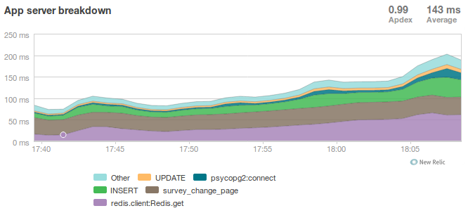

=================================================
Scaling Your Write-Heavy Django App: A Case Study
=================================================

Tobias McNulty

`@tobiasmcnulty <https://twitter.com/tobiasmcnulty>`_

Slides: http://cakt.us/djangocon-scaling

----

About Me
========

* I help run Caktus
* We build custom Python/Django web apps in NC
* Developer with a penchant for infrastructure

Presenter Notes
---------------
- I'm a co-founder and managing member at Caktus Group in Chapel Hill NC
- I'm a developer, but might be a sysadmin at heart.

----

Talk Outline
============

- Project Overview
- Scaling Phase I: Chicago Public Schools
- Scaling Phase II: The State of Illinois
- Optimizing Your PostgreSQL Config

----

Project Overview
================

----

5Essentials Schools Surveys
===========================

Started at UChicago; 5Essentials team designs and conducts surveys to assess:

* Effective leaders
* Collaborative teachers 
* Involved families
* Supportive environment 
* Ambitious instruction

Schools with strong scores on at least 3 of these are 10 times more likely to improve math and reading.

See: http://uchicagoimpact.org/5essentials/

Presenter Notes
---------------

- I'll be talking about a client project we've been working on at Caktus for the past 2 years
- 5 essentials survey admin module
- This group, here in Chicago, has been conducting surveys for years geared towards improving educational outcomes

----

From Scantron...
================

Image: http://www.flickr.com/photos/thedavisblog/2230010178

Presenter Notes
---------------

- Traditionally this was done via Scantron
- But, in 2011, Caktus was approached by the 5E / UChicago team to help build a highly scalable web application in Django

----

About the Project
=================

**5Essentials Survey Admin Module (SAM)**

- 2011: Caktus hired by UChicago / 5Essentials
- 2012: First survey for Chicago Public Schools (~400,000 students)
- 2013: First Illinois state-wide survey (2 million students, teachers, and parents)

Presenter Notes
---------------

- The first survey was administered with the system in early 2012, for Chicago Public Schools
- CPS is 3rd largest in US, over 400,000 students
- 5E has a number of clients outside Chicago
- As of 2013 this inclues the Illinois State Board of Education

----

...to Scalable Web App
======================

Presenter Notes
---------------

- Earlier this year they conducted the first state-wide survey using this tool, for over 2 million parents, students, and teachers

----

Survey Composition
==================

- Up to 50-60 pages per survey
- Around 4-6 questions per page
- Respondents complete in an hour or less

Presenter Notes
---------------

- Before we start talking about scaling it's helpful to have a sense of what a typical survey might look like
- The surveys are typically broken up into quite a few pages with several questions on each page
- Each student is allotted an hour to take it (they don't usually take the full amount of time)

----

Write-heavy App
===============

- Many auxiliary views (about 80)
- Roughly 5 high-use views for survey taking:
    - ``survey_login`` - Login page
    - ``survey_display`` - Load main page for survey taking
    - ``survey_change_page`` - Ajax ``POST`` URL (for saving current data)
    - ``survey_content`` - Ajax ``GET`` URL (for next page)
    - ``survey_complete`` - Non-ajax ``GET`` upon survey completion
- ``Model.objects.bulk_create()`` helps

Presenter Notes
---------------

- The project is quite large, with about 85 Django views in total and at least 40 custom models
- Only about 5 of those views really matter scaling-wise
- The remaining 80 or so are for use by administrators uploading surveys or rosters, downloading responses, managing users, and other related tasks
- A core requirement was to save the results to disk on each page submission, so the survey_change_page view is doing a lot of writes
- This means 4-5 INSERT statements per page, which can be grouped into one statement using the bulk_create method in Django 1.4

----
    
Fast or Scalable?
=================

- Fast: the code runs quickly
- Scalable: runs acceptably (or better) for lots of people

Presenter Notes
---------------

- This brings up the good point that this talk is not about making your code fast, it's about making infrastructure that can scale
- We really don't care about those other 80 views for scaling purposes
- The main problem we're likely to run into is inserting all that data into the response items table
- As well as all the usual suspects in terms of server configuration

----

Architecture
============

- Python 2.7
- Django 1.5
- PostgreSQL 9.1
- Nginx
- Gunicorn
- S3 for static media
- Celery
- RabbitMQ
- Redis
- Memcached

Presenter Notes
---------------

- Before we dive in, here's a quick overview of what we have to work with tools-wise
- The usual suspects, Python 2.7, Django 1.5, and Postgres 9.1
- For web server we're using Nginx to proxy a set of Gunicorn workers, and S3 for static media
- We're using Celery and rabbitMQ for background tasks
- Redis for sessions
- And memcached for a cache

----

Systems Diagram
===============

.. image:: static/CCSR_server_diagram.png
    :align: center

----

Scaling Phase I: Chicago Public Schools
=======================================

----

Phase I Scaling Target
======================

- About 210,000 students (400,000 eligible)
- About 24,000 teachers
- Up to 8,000 survey takers per hour
- Around 275 requests/second

Presenter Notes
---------------

- The first phase of scaling was relatively straight forward; a single laptop could simulate enough load to mimick the maximum expected requests per second.
- We completed this first round of scaling at the end of 2011, before the start of the first web-based Chicago Public Schools survey
- The following steps roughly outline the approach we took to hitting this target
- The # reqs/sec is not particularly high, but remember that these are all dynamic requests, about half of which will be writing to disk

----

Step 1: django-debug-toolbar
============================

Install it:

.. code-block:: sh

    pip install django-debug-toolbar

And add it to your local development settings file:

.. code-block:: python

    INTERNAL_IPS = ('127.0.0.1',)
    MIDDLEWARE_CLASSES.append('debug_toolbar.middleware.DebugToolbarMiddleware')
    INSTALLED_APPS.append('debug_toolbar')

Presenter Notes
---------------

- The first step in any scaling project should generally be to make sure you're not doing anything too crazy code- or DB-wise
- Hopefully all of you are already using django-debug-toolbar, but just in case, I threw in this slide
- Easy to install; helps eliminate unnecessary SQL queries on high-traffic pages
- Don't blindly optimize everything, focus on pages that'll give you the most gain

----

Step 1: Common query reduction patterns
=======================================

Common patterns include:

- **select_related:** When iterating through a list of model objects, use ``select_related()`` with specific field names to retrieve everything you need in one query. Make sure the combined query isn't more expensive.
- **request-local caching:** Find identical queries that you make multiple times during the same request, and cache their output on the request or other relevant Python object (not via ``django.core.cache``)
- **write-through cache:** Find rows that you write (e.g., in a ``POST`` view) and then read back (e.g., in the subsequent ``GET`` view) and cache them in your model's ``save()`` method (see http://cakt.us/scaling-write-cache)

Presenter Notes
---------------

- Remember, we want to limit the total amount of stuff that the DB server has to do
- Ultimately we only care about writes, but if the database server is doing lots of unnecessary reads, that'll slow it down
- Some but not all of this can be taken care of with a DB slave
- We implemented a simple write-through cache for commonly written and re-read data, linked to here

----

Step 2: Automate some load
==========================

Before going any further, you need an easy way to generate load. JMeter's a good tool for that; here there are a few tips:

- **Recording:** If you have a long or complicated process to test, use JMeter's proxy server to record your actions in a web browser
- **Sane defaults:** Set up sane defaults using HTTP Request Defaults, so you can easily switch servers.
- **CSRF Token:** Use JMeter's HTTP Cookie Manager to save and retrieve the token
- **Test script:** Save your test script along side your other infrastructure files in version control.

Presenter Notes
---------------

- need a way to generate some load automatically, don't want to rely on manually clicking around the site, will be doing this in jmeter
- Simple tasks are easy enough to script manually, but it's a lot easier to script longer tasks (like filling out an entire survey) by recording.  JMeter has great tools for this; learn to use & love them.
- You'll want to test different server environments (including your local machine), so practice DRY test script writing and take the time to setup good default for HTTP requests.
- The CSRF token can be a bit hair to keep track of at first, but once you have it set up it's easy to maintain.
- Save your test scripts in version control and continue to refine them.  They'll come in handy over and over again..  Really.

----

Step 3: pgfouine
================

On Debian or Ubuntu:

.. code-block:: sh

    apt-get install pgfouine

Edit ``postgresql.conf``:

.. code-block:: python

    log_min_duration_statement = 0 # log all statements with durations
    log_line_prefix = '%t [%p]: [%l-1] ' # pgfouine-specific log prefix
    lc_messages = 'C' # character encoding pgfouine can understand

After generating some load, run ``pgfouine`` on your log file:

.. code-block:: sh

    pgfouine -file /var/log/postgresql/postgresql.log -logtype stderr > report.html

Presenter Notes
---------------

- Next, pgfouine can help you detect high-frequency, redundant queries *across* multiple requests.
- These could be for the same view or different views
- It comes prepackaged on Debian and Ubuntu, and requires only a few postgres config changes to get the logs in a machine-readable format.
- The final command generates a pretty HTML report that looks something like this:

----

Step 3: pgfouine
================

Presenter Notes
---------------

- At the top is some summary information about the number and length of queries run, including a breakdown of queries by type.
- At the bottom, in a sortable list, are all the queries run, aggregated by what pgfouine sees as similar queries (the same queries with potentially different arguments)

----

Step 4: Let's play cache
========================

We have the data, let's cache strategically.  Options:

- Django's per-site or per-view caches **<- this talk is not about these; you should be using them (if you can) anyways**
- Django's **low-level cache API**
- **johnny-cache** - Great if you need to cache everything
- **django-cache-machine** - Great if you need to cache specific things in specific ways
- **django-better-cache** - Replacement  template tag
- There are many others...

Presenter Notes
---------------

- Based on all the output from pgfouine, you should have a good sense of what queries will give you the most gain for caching.
- Find select statements that you don't expect to change often (if at all), and cache them
- Find a strategy that works for you; we tried to make johnny-cache work, but it was too much black magic for us
- We found django-cache-machine worked better; it allowed us to cache exactly what we want when we wanted in predictable ways

----

Step 4: django-cache-machine
============================

Install it:

.. code-block:: python

    pip install django-cache-machine

Activate it:

.. code-block:: python

    class MyModel(models.Model):
        # ...
        cached = caching.base.CachingManager()

Presenter Notes
---------------
- You can overwride the default manager or create a new one
- We chose the latter to make it explicit that you were caching
- This worked better for us, b/c there's nothing worse that debugging stale cache issues

----

Step 4: django-cache-machine
============================

Some things to be aware of:

- django-cache-machine does not cache empty querysets by default.  If you have a lot these, you might want to turn this on:

.. code-block:: python

    # settings.py
    CACHE_EMPTY_QUERYSETS = True

- ``count()`` cannot easily be invalidated, so these queries time out instead.  Set the timeout to something that makes sense for you:

.. code-block:: python

    # settings.py
    CACHE_COUNT_TIMEOUT = 300

Presenter Notes
---------------

- Once you have caching setup, **use pgfouine to verify that it did what you expected**

----

Step 4: pgfouine, before
========================

.. image:: static/pgfouine-before.png
    :align: center

----

Step 4: pgfouine, after
=======================

.. image:: static/pgfouine-after.png
    :align: center

Presenter Notes
---------------

- As you can see, a little caching quickly cut the SELECT statements by 25,000, to less than 10% of its former value

----

Step 5: Multiple databases
==========================

- **Replication:** Streaming replication in PostgreSQL 9.1
- **Database routing:** django-balancer

Presenter Notes
---------------
- Streaming replication in PostgreSQL 9.1 is incredibly easy to set up. You should learn to use and love it.
- To get multiple databases working in Django you need to use a custom database router.  A good source we've found for this is django-balancer

----

django-balancer
===============

Install it:

.. code-block:: sh

    pip install django-balancer

Configure it:

.. code-block:: python

    DATABASE_ROUTERS = ['balancer.routers.PinningWMSRouter']
    MIDDLEWARE_CLASSES.append('balancer.middleware.PinningCookieMiddleware')
    DATABASE_POOL = {
        'default': 1,
        'db-slave': 1,
    }
    MASTER_DATABASE = 'default'
    MASTER_PINNING_KEY = 'master_db_pinned'
    MASTER_PINNING_SECONDS = 5

Presenter Notes
---------------
- This is a good setup for a master/slave databases
- It sends writes to the master and reads to the slaves, unless a session has written to master in which case reads will also be pinned to the master for 5 seconds.  This avoids data "disappearing" if you attempt to read it back before it propagates to the slave.

----

Custom database router
======================

- In survey app, most common views always write to DB
- Some models don't change during survey taking (those describing the survey)
- Send all reads to slave for some (not all) models

See: http://cakt.us/scaling-router

Presenter Notes
---------------

- There's a problem with this
- Some sessions (e.g., survey taking) write to the DB on every request
- BUT some models never change
- We wrote a simple database router based on django-balancer that makes some models "read only" during certain views
- Just wrap the views you care about with the given decorator, and SELECT queries for the given models will always go to a slave
- In a perfect world this would not get used because everything would be cached, but can help immensely during cache warming or if the cache crashes altogether

----

Step 6: Static Media
====================

... is simple and painless if you:

1. Use ``django_compressor``.
2. Put your media on S3 or CloudFiles.
3. Please, please, *please* enable offline compression.
4. Put a version number in your compress manifest name:

.. code-block:: python

    COMPRESS_OFFLINE_MANIFEST = 'manifest-{{ current_changeset }}.json'

5. If your ```` template tag needs to be in an  tag, put it in its own template and ```` it.

Presenter Notes
---------------
- Django compressor is great and pulls together a number of important extras on top of django.contrib.staticfiles.
- It not only can compress + combine your CSS and JS, but can also do things like process your LESS or SAS files for you at deploy time.
- You really do not want these things taking up a Python web server process, so get them out of the way when you deploy and stop worrying about static media.

----

Step 7: Automated Server Provisioning
=====================================

- Chef, Puppet, or Salt for server configuration
- We used FabulAWS which has declarative configuration in Python
- Use Fabric or something similar to deploy

Presenter Notes
---------------

- Picking an automated server provisioning and deployment tool set is really important
- There's no point trying to scale if you can't quickly and easily create, destroy, and update servers of all types (database, cache, web, worker, etc.)
- This setup is a topic unto itself, but find something that works for you, stick to it, and perfect it.
- If we were to do it over again, today, I'd definitely use Salt instead of rolling our own.  I prefer Python so I'm not a huge fan of Chef or Puppet.
- This becomes particularly important when it comes time to tweak server configuration files on 10-20 web servers at once.  You DO NOT want to be doing that manually.

----

Review of Phase I
=================

So far we have:

- Removed excess queries with django-debug-toolbar and pgfouine
- Set up caching for repetative queries
- Moved all our reads to a slave database
- Automated deployment and offloaded static media
- Implemented a basic load testing script in JMeter

Presenter Notes
---------------

- We have all the ground work in place
- We're not doing anything overly stupid (or so we think)
- Using the JMeter test script we'd created, we simulated enough load to match our scaling target, and using an iterative trial and error process, eliminated all the necessary bottlenecks in the survey taking views

----

Review of Phase I
=================

- Achieved 275 requests/second
- 10 web servers

Presenter Notes
---------------

- After making these changes we easily hit our target of 275 requests/second, and it was evident that there was room to grow if needed
- For this load we had about 10 high-CPU, medium EC2 instances running as web servers
- We also found that a good load average is about 50-60% of all cores on a web server, which you can use to tune the number of servers in use
- Anything above that and performance starts to degrade

----

Scaling Phase II: The State of Illinois
=======================================

Presenter Notes
---------------

- This part of the talk will be a little bit different
- We'll focus specifically on the load testing we did for the state of illinois scaling
- And highlight a few of the specific issues that we ran into along the way.

----

Phase II Scaling Target
=======================

- About 2 million students, teachers, and parents
- Shorter survey
- Up to 50,000 survey takers per hour
- Around 75,000 requests/minute, or 1,250 request/second

Presenter Notes
---------------

- Phase II is quite a bit bigger
- Roughly an order of magnitude in terms of numbers of users
- Due to the shorter survey, about 5 times as many requests per second
- Given that we're moving well beyond the load a single laptop can simulate, we need to rethink how and why we're load testing.

----

Interlude: Postgres-XC
======================

- Main pro: Write-scalable Postgres cluster
- Main con: Dramatically increased systems complexity

Presenter Notes
---------------

- At this point, we evaluated a number of different options, including several NoSQL databases, as well a product called Postgres-XC
- For all the post-survey response processing, the application relies heavily on the Django ORM, so we weren't ready to sacrifice that for a new API
- Postgres-XC looked promising, but it was not clear if the set up could be sufficiently automated. This led us to do further load testing before committing to something like this
- This brings up the good question of why we load test in the first place

----

Why load test?
==============

- Obtain estimates of per-web server capacity
- Correctly size your database servers
- Fix any configuration bottlenecks
- Verify the need for larger architecture changes

Presenter notes
---------------

- There are lots of good reasons to load test, most of which fall along the same lines of why we do any testing
- We want to discover problems and fix them before our users see them
- In this case, we're really testing the infrastructure itself, answering questions like: Did we configure all the different services correctly? Can my current system architecture handle the load?
- Problems of scale are particulary easy to ignore, because you really don't see them during development unless you try really hard
- Conversely, load testing lets you avoid premature optimization by backing up configuration choices with real data rather than abstract guesses

----

Before we start
===============

- Many interdependent configs
- Don't guess, make a spreadsheet
- Calculate how many connections you need to different services
- Make educated forecasts about capacity

Presenter Notes
---------------
- Before you take on a project like this, I highly recommend mapping out the key configuration items in a spreadsheet
- Helps you figure out what to set all the various connection limits and worker counts to
- Also helps forecase load capacity

----

Server Diagram
==============

.. image:: static/CCSR_server_diagram.png
    :align: center

Presenter Notes
---------------

- As a reminder, here's the server diagram for our systems architecture

----

Spreadsheet
===========

See: http://cakt.us/scaling-config

Presenter Notes
---------------

- Here's an example of a spreadsheet we put together for this project
- These calculations are all about juggling what you're going to run out of
- For example, 10 web servers, 30 workers on each, that means up to 300 open DB connections
- That's too many, so we use pgbouncer on each of the web servers to share 2 or 3 persistent postgres connections across 30 workers
- There's a link to a google doc you can copy and tweak

----

Generating load at scale
========================

- Single JMeter instance not useful above 400-600 threads
- Need to run load test from the cloud
- Do it yourself, or use BlazeMeter or another provider

Presenter Notes
---------------

- JMeter is great, but not useful above 400-600 threads on a laptop
- I played around with a few things for this, eventually settled on a service called BlazeMeter
- Lets you upload your JMeter scripts and deploy them to multiple EC2 servers, and collect the results
- Integrates with New Relic
- (Neither of these companies are paying me to say this, though they probably should)

----

survey_change_page, gevent
==========================

.. image:: static/nr1/sample1.png
    :align: center

Presenter Notes
---------------

- Here's one of the first graphs we saved while load testing
- From the main view for survey taking that does the writes to disk
- The big bars are redis GET and SET

----

What's going on?
================

- redis oddly slow, but not overloaded
- Also saw nf_conntrack errors in dmesg

Presenter Notes
---------------

- Redis appeared to be slow in new relic, but when tested from the console, it was lightning fast (even under load).
- We were getting lots of nf_conntrack errors in dmesg
- This is using the gevent worker, which uses an event loop to process lots of requests in the same thread

----

survey_change_page, sync
========================

.. image:: static/nr2/sample2.png
    :align: center

Presenter Notes
---------------

- We disabled connection tracking and switched to the sync worker
- Bottleneck immediately transferred to the database INSERT statement
- What is happening here?

----

What was happening?
===================

- gevent worker is really bad for CPU-bound applications
- Makes I/O **look** expensive

Presenter Notes
---------------

- gevent worker is intended for long-polling applications, when you need to open lots of inactive HTTP connections
- This can be really bad for CPU-bound applications that open and close lots of connections
- Can make I/O look expensive, when the real problem is each thread is trying to process too many requests at once
- The Linux kernel is really good at pre-emptive multitasking.  You should let it do its job and use the sync worker for CPU bound applications.
- Moving on, now we have a new problem...

----

Database Reponse Time
=====================

Presenter Notes
---------------

- As you can see, DB response time sky rockets, and the server eventually crashes before the test is complete

----

Database Falls Over
===================

.. image:: static/nr2/pg-crash.png
    :align: center

Presenter Notes
---------------

- Here's a screenshot of TOP immediately before the crash; lots of defunct postgres processes and a load average of 182.
- Not good.

----

Database Still Overloaded
=========================

.. image:: static/nr3/sample3.png
    :align: center

Presenter Notes
---------------

- Increased database server size by several orders of magnitude - 68 GB of ram and 26 EC2 compute units
- DB server still slow and overloaded.. what is wrong?
- Went back and checked the math..
- Oops.. we're load testing 3x our target, swamping the servers with requests they can't process
- Make yourself a spreadsheet upfront so you don't make the same mistake I did

----

The Right Target Load
=====================

Presenter Notes
---------------

- database server response time is nice and fast
- redis is taking up more time than the DB again

----

HTTP Requests
=============

Presenter Notes
---------------

- target reqs/min are right where we want at 75,000

----

PostgreSQL Transactions
=======================

.. image:: static/nr4/pg-transactions.png
    :align: center

Presenter Notes
---------------

- postgresql master transactions hit over 9,500 per second
- the majority of them writes
- wow!

----

Recreate from Scratch, Test Again
=================================

- Recreated all servers from scratch
- Response time was no where near what it was before
- Postgres could barely hit 6,000 transactions/second

Presenter Notes
---------------

- Just to check everything, recreated all the servers
- Did this because everything needs to be automated, needed to verify same performance
- Performance dropped significantly
- Discovered a couple database server configuration changes I neglected to add to version control

----

Optimizing your PostgreSQL config
=================================

Presenter Notes
---------------

- Before getting to those, a couple notes on optimizing your pg config in general

----

Optimizing PostgreSQL: Where to Start
=====================================

- `Postgres When It's Not Your Job <http://thebuild.com/presentations/not-your-job.pdf>`_ (Christophe Pettus)
- `Secrets of PostgreSQL Performance <http://media.revsys.com/talks/djangocon/2011/secrets-of-postgresql-performance.pdf>`_ (Frank Wiles)
- pgtune
- http://cakt.us/pg-tuning
- http://cakt.us/pg-conns

Presenter Notes
---------------

- Optimizing your Postgres config is a topic until itself
- Our conference chair christophe gave an excellent talk last year titled Postgres When It's Not your Job.  You should get the slides and read them - it's amazing.
- If you're looking for something quick, pgtune can be used to generate some sane defaults for a number of postgres config options
- The last two links are to the Postgres wiki; they provide a lot of valuable discussion about different config options and how they interact
- I'll also share a couple things we found which either aren't covered or are important enough to bring up again.

----

Figuring out max_connections
============================

- Base max_connections on database server resources, not web server count
- Use pgbouncer to share a small number of persistent connections
- Run pgbouncer on your web servers using ``supervisord``

Presenter Notes
---------------

- First, max_connections are an often mis-understood topic
- After a point, the more your database server is doing at once, the longer it takes for **every** task
- The right value for this setting is determined by machine resouces, NOT how many connections you think you need to open
- Again, you can use transaction-level isolation in pgbouncer to share 2-3 connections across 30 web processes with no loss of performance
- Even if you don't set max_connections this low, make sure you're limiting the connections through some other means such as pgbouncer
- If you're already using supervisord, it's an easy addition to run pgbouncer to your config (rather than mucking around with files in /etc/)

----

What was this talk about again?
===============================

Optimizing ``postgresql.conf`` for heavy ``INSERT`` load:

- **commit_delay = 4000** - delay each commit this many microseconds in case we can do a group commit
- **commit_siblings = 5** - only delay if at least N transactions are in process

(Note: this is now even better in PostgreSQL 9.2: http://cakt.us/pg-group-commit)

Presenter Notes
---------------

- Lastly, there's rarely a magic bullet in server configuration, but this turned out to be it for us.
- commit_delay - Rarely helps, but when it does, it helps a lot (and write-intensive applications are the perfect time to use it).
- It works by sleeping for a set number of microseconds immediately before syncing to disk
- When it wakes up, it checks to see if any other transactions are also sleeping before syncing
- It "takes over" all sleeping transactions, syncing their data to disk at the same time as its own
- When a transaction wakes up, it checks to see if it's already been sync'ed, and if it has, it returns immediately to the user
- While this can make everything slower, but setting commit_siblings to a resonable value can make sure it only impacts performance when there might be something to be gained.
- Arrived at these values through trial and error and by reading this post.

----

Final Tweaks
============

----

The Right Target Load
=====================

Presenter Notes
---------------

- You'll also notice on the last load test for survey_change_page that redis is taking up a significant amount of time
- We were still using redis for both cache and sessions at this point, and discovered that it was using near 100% of a single core on the cache server.
- Redis unfortunately is single threaded, so we swapped in memcached for the cache and continued to use redis for sessions (since it is persistent while memcached is not)

----

survey_change_page, with memcached
==================================

.. image:: static/nr5/sample5.png
    :align: center

Presenter Notes
---------------

- So after we made those changes, redis disappeared from the graph and memcached took up a much more consistent chuck of the total time.
- It was also evident from the server that memcached would have no trouble saturating additional CPU cores as needed.

----

Final Performance
=================

.. image:: static/nr5/final-dashboard.png
    :align: center

Presenter Notes
---------------

- Once again, we'd hit the necessary 75,000 requests per minute, and all the servers could be easily recreated from scratch
- For this load we ended up using about 16 extra large, high CPU instances for web servers

---

That's all!
===========

----

Questions?
==========

- Tobias McNulty
- Twitter: `@tobiasmcnulty <https://twitter.com/tobiasmcnulty>`_
- Hire us: http://www.caktusgroup.com
- Slides: http://cakt.us/djangocon-scaling

----

The NoSQL Slide
===============

PostgreSQL:

- **synchronous_commit = off** - don't wait for fsync before returning success

Presenter Notes
---------------
- Another useful option that can be handy if you don't care about the durability of a transaction is synchronous_commit
- It's not as bad as disabling fsync b/c there's no risk of data inconsistency
- But IF the server crashes BEFORE it can call fsync but AFTEr it returns success to the user, there might be an inconsistency between what the user thinks was saved and what was actually saved. 
- Obviously this is not good for banking transactions, but there are plenty of other less critical applications out there that might benefit from disabling this feature in Postgres.
- We did not use this in the survey app because commit_delay got us where we needed to be.

