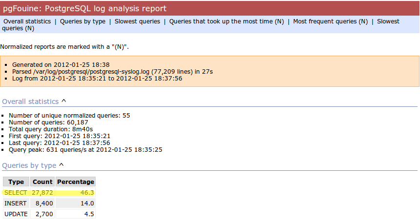

=================================================
Scaling Your Write-Heavy Django App: A Case Study
=================================================

Tobias McNulty
@tobiasmcnulty

http://cakt.us/djangocon-scaling

----

Talk Outline
============

- Introductions
- Removing extra queries with django-debug-toolbar
- Creating a test script with JMeter
- Analyzing your Postgres logs for repetitive queries
- Set up caching
- Configuring multiple databases
- Static media
- Automated deployment
- Running your test script at scale
- Optimizing your web server configuration
- Final tweaks to your Postgres configuration

----

About Me
========

* I help run Caktus - we build custom Python/Django web apps in NC
* Developer with a penchant for infrastructure

----

5Essentials Schools Surveys
===========================

Started at UChicago; 5Essentials team designs and conducts surveys to assess:

* Effective leaders
* Collaborative teachers 
* Involved families
* Supportive environment 
* Ambitious instruction

Schools with strong scores on at least 3 of these are 10 times more likely to improve math and reading.

See: http://uchicagoimpact.org/5essentials/

----

From Scantron...
================

.. image:: static/scantron.jpg
    :align: center

Image: http://www.flickr.com/photos/thedavisblog/2230010178

----

About the Project
=================

**5Essentials Survey Admin Module (SAM)**

- 2011: Caktus hired by UChicago / 5Essentials
- 2012: First survey for Chicago Public Schools (~400,000 students)
- 2013: First Illinois state-wide survey (2 million students, teachers, and parents)

Presenter Notes
---------------

- CPS is 3rd largest in US, over 400,000 students

----

...to Scalable Web App
======================

.. image:: static/survey.jpg
    :align: center

----

Fast or Scalable?
=================

- Fast: the code runs quickly
- Scalable: runs acceptably (or better) for lots of people

----

Why this talk?
==============

Scaling read-heavy web apps is easy:

- Add caching, add web servers
- Rinse, repeat

Taking a survey means saving lots of data really fast.

----

Architecture
============

- Python 2.7
- Django 1.5
- Python 2.7
- PostgreSQL 9.1
- Nginx
- Gunicorn
- Celery
- Redis
- Memcached
- RabbitMQ
- S3 for static media

Presenter Notes
---------------

- Before we dive in, I wanted to give you an overview of what we have to work with tools-wise
- 

----

Step 1: django-debug-toolbar
============================

Install it:

.. code-block:: sh

    pip install django-debug-toolbar

And add it to your local development settings file:

.. code-block:: python

    INTERNAL_IPS = ('127.0.0.1',)
    MIDDLEWARE_CLASSES.append('debug_toolbar.middleware.DebugToolbarMiddleware')
    INSTALLED_APPS.append('debug_toolbar')

Presenter Notes
---------------
- If you haven't used it, you really need to now, and it's really easy to install
- Need to eliminate unnecessary SQL queries on high-traffic pages
- Don't blindly optimize everything, focus on pages that'll give you the most gain

----

Step 1: django-debug-toolbar
============================

Common patterns include:

- **select_related:** When iterating through a list of model objects, use ``select_related()`` with specific field names to retrieve everything you need in one query. Make sure the combined query isn't more expensive.
- **request-local caching:** Find identical queries that you make multiple times during the same request, and cache their output on the request or other relevant Python object (not via ``django.core.cache``)

Presenter Notes
---------------

- Remember, we want to limit the total amount of stuff that the DB server has to do
- Ultimately we only care about writes, but if the database server is doing lots of unnecessary reads, that'll slow it down
- Some but not all of this can be taken care of with a DB slave

----

Step 2: Automate some load
==========================

Before going any further, you need an easy way to generate load. JMeter's a good tool for that; here there are a few tips:

- **Recording:** If you have a long or complicated process to test, use JMeter's proxy server to record your actions in a web browser
- **Sane defaults:** Set up sane defaults using HTTP Request Defaults, so you can easily switch servers.
- **CSRF Token:** Use JMeter's HTTP Cookie Manager to save and retrieve the token
- **Test script:** Save your test script along side your other infrastructure files in version control.

Presenter Notes
---------------

- Simple tasks are easy enough to script manually, but it's a lot easier to script longer tasks (like filling out an entire survey) by recording.  JMeter has great tools for this; learn to use & love them.
- You'll want to test different server environments (including your local machine), so practice DRY test script writing and take the time to setup good default for HTTP requests.
- The CSRF token can be a bit hair to keep track of at first, but once you have it set up it's easy to maintain.
- Save your test scripts in version control and continue to refine them.  They'll come in handy over and over again..  Really.

----

Step 3: pgfouine
================

Next, pgfouine can help you detect high-frequency, redundant queries *across* multiple requests.

On Debian or Ubuntu:

.. code-block:: sh

    apt-get install pgfouine

Edit ``postgresql.conf``:

.. code-block:: python

    log_min_duration_statement = 0 # log all statements with durations
    log_line_prefix = '%t [%p]: [%l-1] ' # pgfouine-specific log prefix
    lc_messages = 'C' # character encoding pgfouine can understand

After generating some load, run ``pgfouine`` on your log file:

.. code-block:: sh

    pgfouine -file /var/log/postgresql/postgresql.log -logtype stderr > report.html

----

Step 3: pgfouine
================

.. image:: static/pgfouine.png
    :align: center

----

Step 4: Let's play cache
========================

We have the data, let's cache strategically.  Options:

- Django's per-site or per-view caches **<- this talk is not about these; you should be using them (if you can) anyways**
- Django's **low-level cache API**
- **johnny-cache** - Great if you need to cache everything
- **django-cache-machine** - Great if you need to cache specific things in specific ways
- There are many others...

Presenter Notes
---------------

- Based on all the output from pgfouine, you should have a good sense of what queries will give you the most gain for caching.
- Find select statements that you don't expect to change often (if at all), and cache them
- Find a strategy that works for you; we tried to make johnny-cache work, but it was too much black magic for us
- We found django-cache-machine worked better; it allowed us to cache exactly what we want when we wanted in predictable ways

----

django-cache-machine
====================

Install it:

.. code-block:: python

    pip install django-cache-machine

Activate it:

.. code-block:: python

    class MyModel(models.Model):
        # ...
        cached = caching.base.CachingManager()

Presenter Notes
---------------
- You can overwride the default manager or create a new one
- We chose the latter to make it explicit that you were caching
- This worked better for us, b/c there's nothing worse that debugging stale cache issues

----

django-cache-machine
====================

Some things to be aware of:

- django-cache-machine does not cache empty querysets by default.  If you have a lot these, you might want to turn this on:

.. code-block:: python

    # settings.py
    CACHE_EMPTY_QUERYSETS = True

- ``count()`` cannot easily be invalidated, so these queries time out instead.  Set the timeout to something that makes sense for you:

.. code-block:: python

    # settings.py
    CACHE_COUNT_TIMEOUT = 300

Presenter Notes
---------------

- Once you have caching setup, **use pgfouine to verify that it did what you expected**

----

pgfouine, before
================

----

pgfouine, after
================

.. image:: static/pgfouine-after.png
    :align: center

----

Step 5: Multiple databases
==========================

- **Replication:** Streaming replication in PostgreSQL 9.1
- **Database routing:** django-balancer

Presenter Notes
---------------
- Streaming replication in PostgreSQL 9.1 is incredibly easy to set up. You should learn to use and love it.
- To get multiple databases working in Django you need to use a custom database router.  A good source we've found for this is django-balancer

----

django-balancer
===============

Install it:

.. code-block:: sh

    pip install django-balancer

Configure it:

.. code-block:: python

    DATABASE_ROUTERS = ['balancer.routers.PinningWMSRouter']
    MIDDLEWARE_CLASSES.append('balancer.middleware.PinningCookieMiddleware')
    DATABASE_POOL = {
        'default': 1,
        'db-slave': 1,
    }
    MASTER_DATABASE = 'default'
    MASTER_PINNING_KEY = 'master_db_pinned'
    MASTER_PINNING_SECONDS = 5

Presenter Notes
---------------
- This is a good setup for a master/slave databases
- It sends writes to the master and reads to the slaves, unless a session has written to master in which case reads will also be pinned to the master for 5 seconds.  This avoids data "disappearing" if you attempt to read it back before it propagates to the slave.

----

Custom database router
======================

- In survey app, most common views always write to DB
- Some models don't change during survey taking (those describing the survey)
- Send all reads to slave for some (not all) models

See: http://cakt.us/scaling-router

Presenter Notes
---------------

- There's a problem with this
- Some sessions (e.g., survey taking) write to the DB on every request
- BUT some models never change
- We wrote a simple database router based on django-balancer that makes some models "read only" during certain views
- Just wrap the views you care about with the given decorator, and SELECT queries for the given models will always go to a slave

----

Step 6: Static Media
====================

... is simple and painless if you:

1. Use ``django_compressor``.
2. Put your media on S3 or CloudFiles.
3. Please, please, *please* enable offline compression.
4. Put a version number in your compress manifest name:

.. code-block:: python

    COMPRESS_OFFLINE_MANIFEST = 'manifest-{{ current_changeset }}.json'

5. If your ```` template tag needs to be in an  tag, put it in its own template and ```` it.

Presenter Notes
---------------
- Django compressor is great and pulls together a number of important extras on top of django.contrib.staticfiles.
- It not only can compress + combine your CSS and JS, but can also do things like process your LESS or SAS files for you at deploy time.
- You really do not want things things taking up a Python web server process, so get them out of the way when you deploy and stop worrying about static media.

----

Step 7: Automated Server Provisioning
=====================================

- Chef, Puppet, or Salt for server configuration
- We used FabulAWS which has declarative configuration in Python
- Use Fabric or something similar to deploy

Presenter Notes
---------------

- Picking an automated server provisioning and deployment tool set is really important
- There's no point trying to scale if you can't quickly and easily create, destroy, and update servers of all types (database, cache, web, worker, etc.)
- This setup is a topic unto itself, but find something that works for you, stick to it, and perfect it.
- If we were to do it over again, today, I'd definitely use Salt instead of rolling our own.  I prefer Python so I'm not a huge fan of Chef or Puppet.
- This becomes particularly important when it comes time to tweak server configuration files on 10-20 web servers at once.  You DO NOT want to be doing that manually.

Quick Review
============

So far we have:

- Removed excess queries with django-debug-toolbar and pgfouine
- Implemented a basic load testing script in JMeter
- Set up caching for repetative queries
- Moved all our reads to a slave database
- Automated deployment and offloaded static media

Presenter Notes
---------------

- Now comes the fun part
- We have all the ground work in place
- We're not doing anything overly stupid (or so we think)
- Let's try load testing at scale

----

Why load test?
==============

- Obtain estimates of per-web server capacity
- Correctly size your database servers
- Fix any configuration bottlenecks

Presenter notes
---------------

- There are lots of good reasons to load test, most of which fall along the same lines of why we do any testing
- We want to discover problems and fix them before our users see them
- In this case, we're really testing the infrastructure itself
- Did we configure all the different services correctly?
- Can my servers handle the load?
- Problems of scale are particulary easy to ignore, because you really don't see them during development unless you try really hard
- Conversely, load testing lets you avoid premature optimization by backing up configuration choices with real data rather than abstract guesses

----

Before we start
===============

- Many interdependent configs
- Don't guess, make a spreadsheet
- Calculate how many connections you need to different services
- Make educated forecasts about capacity

----

Spreadsheet
===========

.. image:: static/spreadsheet.png
    :align: center

See: http://cakt.us/scaling-config

----

Questions?
==========

Tobias McNulty
@tobiasmcnulty

http://cakt.us/djangocon-scaling

