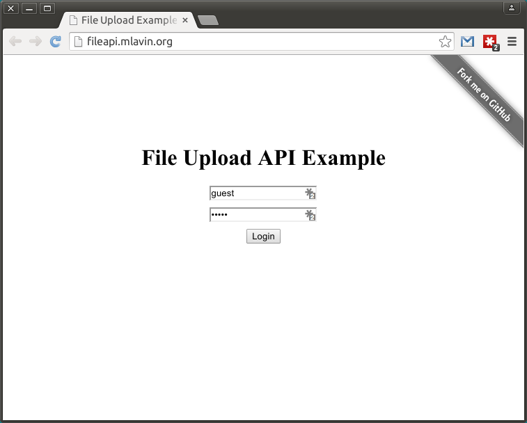
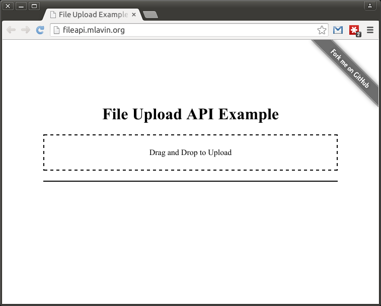
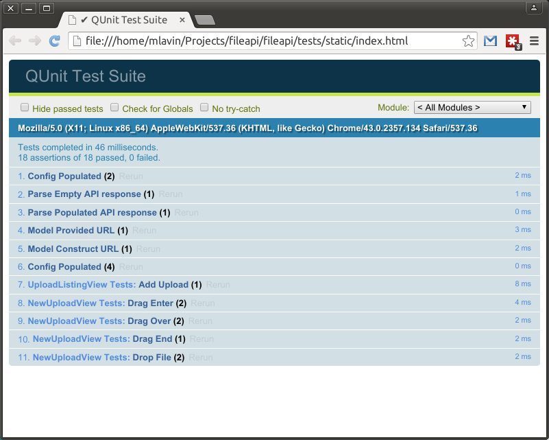

## Intro to Client-Side Testing
Mark Lavin - DjangoCon 2015

@@

## WHOAMI

 <!-- .element: style="float: left" -->

- Technical Director at [Caktus Group](https://www.caktusgroup.com/)
- Co-Author of ["Lightweight Django"](http://shop.oreilly.com/product/0636920032502.do)
- [DrOhYes](https://twitter.com/DrOhYes) on Twitter
- [mlavin](https://github.com/mlavin) on Github

@@

## Goals


Notes:

Get you started testing with a pratical starting point.
This isn't an in-depth review of all testing tools.
Also not going to try to convince you to do testing.
I don't think that argument needs to be made anymore.

Example Project, Integration Tests with Selenium, Unittests with Qunit

@@

## What Are We Testing

Demo: http://fileapi.mlavin.org/

Source: https://github.com/mlavin/fileapi

Notes:
This is a minimal REST API (using JWT for auth) which allows drag and drop file uploads.
On the front-end it uses Backbone.








@@

## API Structure

```
    / - GET to render the app.
    /api-token/ - POST to exchange username/password for JWT.
    /uploads/ - GET to list all current uploads.
                POST to add a new file upload.
    /uploads/<name>/ - GET to see file details.
                       DELETE to remove the upload.
```

Notes:
No PUT for updating files once they've been uploaded.
You are welcome to review the view code but that isn't really the focus here.

@@

## Users Don't Care About Any of This

Notes:
User's don't care about your fancy pure-REST server implementation. They want
to do things: login to the site, navigate around, submit data, etc.

This is what Selenium is good at. It drives a web browser. You can interact with the DOM,
filling out forms, clicking links, etc.

@@

## Selenium Setup

```python
from django.contrib.staticfiles.testing import StaticLiveServerTestCase
from selenium import webdriver

class FunctionalTests(StaticLiveServerTestCase):
    """Iteractive tests with selenium."""

    @classmethod
    def setUpClass(cls):
        cls.browser = webdriver.PhantomJS()
        super().setUpClass()

    @classmethod
    def tearDownClass(cls):
        cls.browser.quit()
        super().tearDownClass()
```

Notes:
The browser setup/teardown can be slow so it helps to only do it once per class. This doesn't
give perfect test isolation but it works well for most use cases.

I like PhantomJS which is a headless Webkit browser but you could replace this with the
Firefox, Chrome, or IE driver. PhantomJS is installed by default on TravisCI which is nice.


## First Selenium Test

```python
class FunctionalTests(StaticLiveServerTestCase):
    ...
    def test_show_login(self):
        """The login should be shown on page load."""

        self.browser.get(self.live_server_url)
        form = self.browser.find_element_by_id('login')
        upload = self.browser.find_element_by_id('upload')
        self.assertTrue(
            form.is_displayed(),
            'Login form should be visible.')
        self.assertFalse(
            upload.is_displayed(),
            'Upload area should not be visible.')

```

Notes:
This is the first taste of what you can do with Selenium. Find elements in the DOM and assert
things about them. In this case a user expects to load the app and see the login form.


## Form Submission

```python
class FunctionalTests(StaticLiveServerTestCase):
    ...
    def login(self, username, password):
        """Helper for login form submission."""

        self.browser.get(self.live_server_url)
        form = self.browser.find_element_by_id('login')
        username_input = form.find_element_by_name('username')
        username_input.send_keys(username)
        password_input = form.find_element_by_name('password')
        password_input.send_keys(password)
        form.submit()
```

Notes:
You can fill out forms by using ``send_keys`` once you have selected that element from the DOM.
You can submit a form by calling submit on the form itself (which would be like hitting enter)
or you could select submit button if there is one and submit it.


## Waiting

```python
from selenium.webdriver.common.by import By
from selenium.webdriver.support import expected_conditions
from selenium.webdriver.support.ui import WebDriverWait
...
class FunctionalTests(StaticLiveServerTestCase):
    ...
    def test_login(self):
        """Submit the login form with a valid login."""

        self.login(self.username, self.password)
        WebDriverWait(self.browser, 5).until(
            expected_conditions.visibility_of_element_located(
                (By.ID, 'upload')))
        form = self.browser.find_element_by_id('login')
        self.assertFalse(
            form.is_displayed(),
            'Login form should no longer be visible.')
```

Notes:
WebDriverWait defines the API for explicit wait conditions. You can wait on a number
of different things such as existance of a new element or an JS alert or the page title
changing. In this case we wait for an element to become visible up to 5 seconds.

There are also implicit waits which will just wait for a set amount of time. Obviously that
will add time to your test runtime. And following the Zen of Python, explicit is better than
implicit.


## Users Aren't Always Right

```python
class FunctionalTests(StaticLiveServerTestCase):
    ...
    def test_invalid_login(self):
        """Submit the login form with an invalid login."""

        self.login(self.username, self.password[1:])
        error = WebDriverWait(self.browser, 5).until(
            expected_conditions.presence_of_element_located(
                (By.CLASS_NAME, 'error')))
        self.assertEqual('Invalid username/password', error.text)
        form = self.browser.find_element_by_id('login')
        self.assertTrue(
            form.is_displayed(),
            'Login form should still be visible.')
```

Notes:
We want to test the things that users do and sometimes they make mistakes. You
should test those as well.

These end-to-end tests are great but they are slow and can be fragile. If the DOM
changes slightly, changed element ID or class name, they can break even though the
overall functionality isn't broken.

@@

## JS Testing


Notes:
For particular endcases in logic it's hard to beat a good isolated unittest. However,
this often goes out the window when writing JS. Since I feel like in general the
Django community values testing, there has to be a reason. Largely I think
it's education.

There are a number of different testing frameworks in the Javascript community.
Many have names that don't really tell you what they do.
Qunit, Jasmine, Mocha (no logo), Karma, Protractor


## Why QUnit?


Notes:
Why choose QUnit over any others?
Familiar xUnit style (many JS frameworks are more BDD)
Used by large popular projects like jQuery and Django itself (Thanks Trey Hunter!)

@@

## QUnit Setup

```
<!DOCTYPE html>
<html>
<head>
    <meta charset="utf-8">
    <title>QUnit Test Suite</title>
    <link rel="stylesheet" href="libs/qunit.css">
</head>
<body>
    <div id="qunit"></div>
    <div id="qunit-fixture"></div>
    <script src="libs/qunit.js">
    <script src="../../static/libs/jquery.js">
    <script src="../../static/libs/underscore.js">
    <script src="../../static/libs/backbone.js">
    <script src="../../static/js/models.js">
    <script src="../../static/js/views.js">
    <script src="tests/test_models.js">
    <script src="tests/test_views.js">
</body>
</html>
```

Notes:
This is a static HTML file which includes the QUnit CSS and JS. It also includes
the files we want to tests (models.js and views.js) and there dependencies (jquery, underscore, backbone).

The last two files are the tests themselves.

I know the end of the script tags are missing. There was some wonky issue with Reveal.JS + Markdown + Highlight.JS


## First QUnit Test

```javascript
QUnit.test('Model Provided URL', function (assert) {
    var uploads = new config.collections.UploadCollection(),
        file = {
            name: 'test.png',
            size: 200,
            created: '2015-01-14T01:21:56.870',
            links: {
                self: '/uploads/test.png'
            }
        },
        model = uploads.push(file);
    assert.equal(model.url(), '/uploads/test.png');
});
```

Notes:
The Qunit.test function takes the name of the test then a function for the tests itself. The
test function is given a single argument which is the assert object which has all of the assert
APIs on it.

In this test we are adding a new model to our Backbone collection and asserting that the
model.url method returns the url we expect. Pretty standard unittest. Create an instance of
a class, call one method on the class, assert the return value.


## Setup/TearDown

```javascript
QUnit.module('UploadListingView Tests', {
    beforeEach: function () {
        $('#qunit-fixture').append($('<div>', {id: 'files'}));
        this.view = new config.views.UploadListingView();
    },
    afterEach: function () {
        this.view.remove();
    }
});
```

Notes:
Setup and tear down are done using the Qunit.module function. This groups all of the tests declared
after it. That implicit module grouping is one of the uglier pieces of the API.

This setup creates a
new instance of the UploadListingView and appends it to the DOM. After each test that
view instance is destroyed.
Any state attached to `this` will be available in each test in the module.


## Setup/TearDown Cont..

```javascript
QUnit.test('Add Upload', function (assert) {
    var uploads = new config.collections.UploadCollection(),
        upload = uploads.push({
            name: 'test.png',
            size: 200,
            created: '2015-01-14T01:21:56.870',
            links: {
                self: '/uploads/test.png'
            }
        });
    this.view.addFile(upload);
    assert.equal($('.file', this.view.$el).length, 1);
});
```

Notes:
This is an example of a test in that module. It calls the the addFile function of
the view class and asserts that there is a new element in the DOM. This is again not
handling any user interaction. No clicks or API calls. This just calling methods
on objects.


## Bonus: Mocking with Sinon

```javascript
QUnit.module('NewUploadView Tests', {
    beforeEach: function () {
        $('#qunit-fixture').append($('<div>', {id: 'upload'}));
        this.uploads = new config.collections.UploadCollection();
        this.view = new config.views.NewUploadView(
            {uploads: this.uploads});
        sinon.stub(this.uploads, 'create');
    },
    afterEach: function () {
        this.view.remove();
        this.uploads.create.restore();
    }
});
```

Notes:
QUnit itself doesn't come with any mock objects but it does play nicely with
a mock library called Sinon.

In testing the view which handles the drag and drop uploads, we don't actually want
to make the AJAX call to POST to the server. Instead we patch the `create` method
of the Backbone collection.


## Mocking with Sinon Cont..

```javascript
QUnit.test('Drop File', function (assert) {
    var e = $.Event('drop'),
        file = {'name': 'test.txt'};
    e.originalEvent = {
        dataTransfer: {files: [file, ]}
    };
    this.view.$el.addClass('hover');
    this.view.drop(e);
    assert.ok(this.uploads.create.calledOnce);
    assert.equal(this.view.$el.hasClass('hover'), false);
});

```

Notes:
In this test we create a fake DOM event which mimics what would happen when a user
drops a file. We call the `drop` event handler with this fake event and assert
that the collection.create method was called.

@@

## Running QUnit Tests



Notes:
To run the QUnit test suite you simply need to load the HTML file in your browser.
There are also command line tools to run it using phantomjs with your favorite JS
task runner like grunt or gulp.

Of course we also know a nice way to automate a browser in Python...Selenium!


## QUnit + Selenium

```python
from django.test.utils import modify_settings
...
@modify_settings(STATICFILES_DIRS={
    'append': os.path.join(os.path.dirname(__file__), 'static')})
class QunitTests(StaticLiveServerTestCase):
    ...
    # Same Selenium setUpClass/tearDownClass as before
    ...
    def test_qunit(self):
        """Load the QUnit tests and check for failures."""
        test_url = (self.live_server_url +
            settings.STATIC_URL + 'index.html')
        self.browser.get(test_url)
        results = WebDriverWait(self.browser, 5).until(
            expected_conditions.visibility_of_element_located(
                (By.ID, 'qunit-testresult')))
        total = int(results.find_element_by_class_name('total').text)
        failed = int(results.find_element_by_class_name('failed').text)
        self.assertTrue(total and not failed, results.text)
```

Notes:
The modify_settings decorator adds the path where we've stored this static HTML
along with the Qunit JS, CSS and the JS test files themselves. In this case they
all live inside of the tests/ folder in a static folder.

This will load that HTML with Selenium and wait for the test results. It then
asserts that there were tests and none failed. Otherwise it will print the text
in the results element.

@@


@@

## Resources

- https://docs.djangoproject.com/en/1.8/topics/testing/
- https://selenium-python.readthedocs.org/
- https://qunitjs.com/
- http://sinonjs.org/

@@

## Photo Credits

- https://www.flickr.com/photos/angietorres/4564135455/
- https://www.flickr.com/photos/alikins/4439062727/

@@

## Thanks!

### Questions?

http://talks.caktusgroup.com/djangocon/2015/client-side-testing/

*Book signing at the Caktus booth 2:50 PM*
