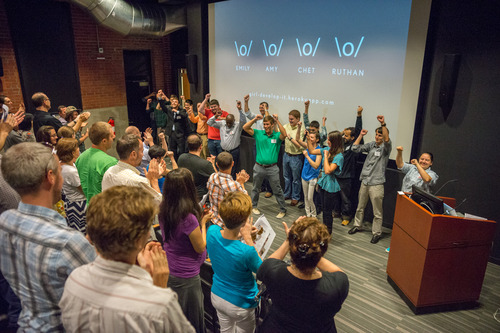
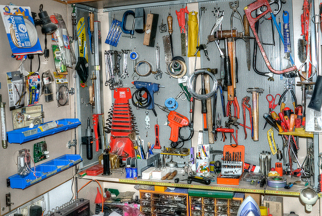
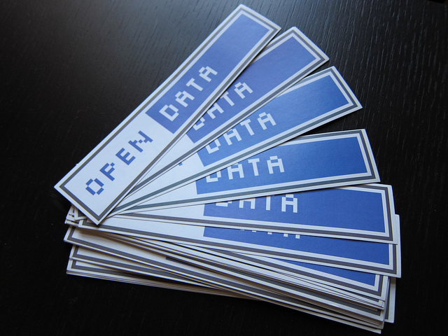
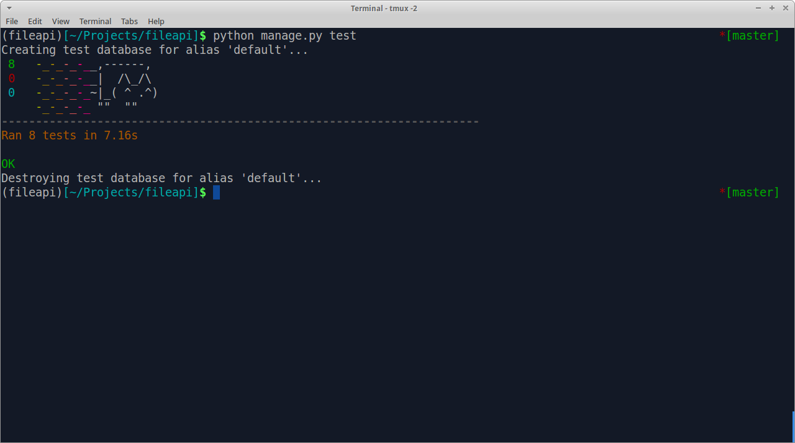

## Demo Day
### A Hiring Manager's Perspective

@@

## Mark Lavin

 <!-- .element: style="float: left" -->

- Technical Director at [Caktus Group](https://www.caktusgroup.com/)
- O'Reilly Author
- [DrOhYes](https://twitter.com/DrOhYes) on Twitter

Notes:
Apart for my role as a technical manager, I'm also a develoer. At Caktus we have
quarterly Ship It Days where we built whatever crazy things in a day. I've had
my own share of successes and epic failures and I think that process shares a lot
of similarities to these final projects.

@@

Notes:
I've been to almost every Demo Day here in Durham. This is a picture I shamelessly
grabbed from the IronYard blog of the very first Demo Day and that's me right there
with our CEO Tobias. So I've seen a lot of projects good and bad.
I've also interviewed (and hired) more than my fair share of Iron Yard grads.
Final projects make up a big part of those conversations.

@@

## ⊙▂⊙ / ♥╭╮♥ / ◕ ◡ ◕

Notes:
When I'm at Demo Day and looking to hire someone, I'm looking for people that made smart decisions
and played to their strengths. I like to see people who stretched themselves and took calculated
risks. Also teams that worked well together and people that made the ones around them better.

@@

## The Project is Not the Product

Notes:
Demo day isn't a VC pitch day. People aren't here to buy what you built. They are
here to see you. You have very limited time so you need to make it interesting
enough that people want to know more. It doesn't need to be crazy complicated.
It needs to be unique enough to know you didn't copy and pasted it from somewhere. That's about it
It needs to be well executed and it needs to tell a story. 

@@

## Put Yourself into the Project

Notes:
Whether or not the project is your idea you need to find a way to put yourself into it.
Most projects are web projects but as you've seen Python does more than just the web.
Interested in data science? Make sure to carve out some data science.
Interested in dev ops? Maybe work on the deployment.
If you are interested in the web you probably need to show that you can do at least something
meaningful on the front end (HTML and CSS).

@@

## What Makes Project a Successful?

Notes:
Each person here likely has a different version of success but my guess would that
many of you came to the Iron Yard to get jobs in software development. So a successful
project would be one that moves you closer to that goal. The final project is a chance
to showcase your talent, interests, and your ability to work on a team. Here are my thoughts
on how to do that.

@@

Notes:
Be smart laxy. Make good choices of the tools you use.
Y'all don't have a front-end class to work with.
If you are going to build a web project
some of your are going to have to stretch to that role. Or you need to find a way
to minimize that need. Focusing on the demo and telling your stories
you really only need a handful of pages to demo. Start from
the shortboard/flow of the demo and work backwards.

@@

<aside class="credit">
    <a href="https://www.flickr.com/photos/dorlino/4946061042/">
        https://www.flickr.com/photos/dorlino/4946061042/
    </a>
</aside>

Notes:
Use the right tools for the job and don't add needless depenencies. In a project timeline as fast as
these final projects you can't spend time vetting and learning lots of additional tools. If you choose
a front-end framework like Bootstrap or Foundation or Material Design then make sure you carve out
some time to give it a little personality. It's amazing how changing just a single font or color can
make it seem like it's not just another Bootstrap site.

@@

Notes:
Know what's new right now. I hear that Slack is pretty popular here at the IronYard. What about building
a Slack bot? You wouldn't need to build a web UI, just an API.
"Serverless" deployments like AWS Lambda are another trend right now.

@@

<aside class="credit">
    <a href="https://www.flickr.com/photos/jwyg/4528443760/">
        https://www.flickr.com/photos/jwyg/4528443760/
    </a>
</aside>

Notes:
One challenge that projects have had is picking something that needs to be populated
with user data. This is hard when there aren't any or very many users. In particular
if you want to do some meaningful data analysis, you need more than 3-4 users.
Durham has an open data portal which gives you access to all kinds of info about
area businesses, people, and the environment.

There are large datasets available on AWS as well from census data to genome sequences to
satelitte images. Go crazy with them.

@@

Notes:
Don't skimp on testing. You probably think you don't have time but you do. You don't have time for
everything to be broken the day before the demo. Track your coverage from day one and don't let it
drop. Hold each other accountable.

Don't know much about testing? Would you rather go into an interview with no experience or with
some experience to talk about? WRITE TESTS!!

@@

<aside class="credit">
    <a href="https://www.flickr.com/photos/darwinbell/1454251440/">
        https://www.flickr.com/photos/darwinbell/1454251440/
    </a>
</aside>

Notes:
Secure your site. There SSL certificates are free and it's hard to justify any new project which
doesn't have TLS enabled. If you are using Django spend time to read about the security middleware
and the deployment checklist. These are all things you are going to want to know.

@@

## References

- https://opendurham.nc.gov/page/home/
- https://aws.amazon.com/public-data-sets/
- https://travis-ci.org/
- https://codecov.io/
- https://letsencrypt.org/
- https://docs.djangoproject.com/en/1.9/howto/deployment/checklist/

@@

## Resources

- [Lightweight Django](http://shop.oreilly.com/product/0636920032502.do)
- [Intermediate Django](http://shop.oreilly.com/product/0636920040903.do)
- https://www.caktusgroup.com/blog/
- http://caktus.github.io/developer-documentation/
- https://github.com/caktus/django-project-template
- https://github.com/mlavin/mini-template
- https://github.com/caktus/taytay
- https://github.com/mlavin/secretcards

@@

## Thanks!
### Questions?

http://talks.caktusgroup.com/ironyard/2016/demo-day/

