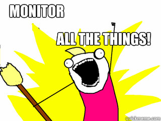

Monitor all the things
============================================================

Scott Morningstar

Caktus Lighting Lunch

http://quickmeme.com

Presenter Notes
---------------

* You Know This

----

Talk Outline
------------

- Who am I
- This talk is about
- Monitoring what is it?
- What to Monitor
- Tools

----

Who am I
================

- Scott Morningstar
- Systems Administrator at Caktus Consulting Group in Carrboro, NC

.. image:: ./images/caktus-logo.png
    :align: center
    :height: 200px

Presenter Notes
---------------

- I work at Caktusgroup in Carrboro NC

----

About Me
------------

- Geek

- Dad

Presenter Notes
---------------

* Yes that is a Giant Octopus made of Legos
*

-------------------

This talk is about
=====================

- What to collect
- Tools
- Demo

Presenter Notes
---------------

- Notes

----

What to collect
---------------

- Sys
- App

Presenter Notes
---------------

- There are lots of things to collect and you can't tell in advance what will be useful

----

System Stats
------------

- CPU
- Disk usage
- Memory
- System load
- Network usage
- Uptime
- Many others

http://monitor0.caktus.lan

Presenter Notes
---------------

* Munin has hundreds of plugins
* Collectd has about 90

----

Application Information
-----------------------

- Stack trace
- Event Logging
- Anything that goes to a log file anywhere

Presenter Notes
---------------

- Python has good logging but it needs to be used
- Syslog is a blunt tool

----

Tools
---------------

- Munin
- SmokePing
- Graphite
- GreyLog2
- Statsd
- Collectd
- Logstash

Presenter Notes
---------------

- Notes

----

Demo
=================

http://monitor0.caktus.lan
http://monitor0.caktus.lan:8090/smokeping/smokeping.cgi?target=World.TWC_CH_POP

----

Thanks
=================

- links
- More detailed talk by Jason Dixon from Github
- https://speakerdeck.com/obfuscurity/the-state-of-open-source-monitoring
