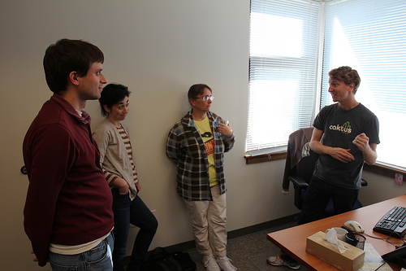

ShipIt Days
================================================

Tobias McNulty

Caktus Consulting Group

October 21, 2012

Presenter Notes
---------------

* Welcome everyone
* My name is Tobias McNulty and I work at Caktus in Carrboro
* We build custom web applications in Django for clients across the US and around the world
* Today I'll be talking about ShipIt Days

----

Talk Overview
------------------------------------------------

* What's a "ShipIt Day"?
* Motivation
* How it Works
* Our First ShipIt Day
* What we Shipped

Presenter Notes
---------------

* To give you a quick overview of the talk I'll begin with a broad overview of what is a ShipIt Day
* Talk a little about our motivation for starting this program and go into the mechanics of how it works
* I'll conclude with a quick recap of our first ShipIt day and give you a quick run-down of the projects we shipped

----

What's a "ShipIt Day"?
-----------------------------------------------

* 24 hours to design and implement a new project
* Unstructured, undirected "free time"
* Works well in software companies like Caktus
* Positive outcome for your company or your team

Presenter Notes
---------------

* A day to work on a project of your choosing
* No structure or guidelines other than trying to help your company or team
* (in a very broad sense)
* The goal is to try new things and ship something or fail fast

----

Where'd we get the idea?
------------------------------------------------

* Proposed by the team
* Daniel Pink's book *Drive*
* Atlassian and Six Feet Up

Presenter Notes
---------------

* Personally I first heard about the idea through Daniel Pink's *Drive*
* The idea was suggested independently by a number of team members
* We checked out what other companies like Atlassian and Six Feet Up
* while creating the guidelines for ours
* We did not want to limit ours to implementing features on company products

----

Motivation
------------------------------------------------

* Foster innovation

Presenter Notes
---------------

* As a software company that makes money building apps for clients, why would
* we want to set aside time for something with no direct financial return?
* Number one, we need to devote resources to research, learning, and creative outreach
* And we need to try new technologies so our skills don't grow stale

----

Motivation
------------------------------------------------

* Foster innovation
* Take a break from the daily grind

Presenter Notes
---------------

* This also means balancing client deadlines and milestones with...

----

Motivation
------------------------------------------------

* Foster innovation
* Take a break from the daily grind
* Scratch a creative itch

Presenter Notes
---------------

* scratching our own creative itches
* In a nutshell, the goal is to provide a forum for acting on ideas
* that come from anyone and everyone on the team, rather than from management

----

Motivation
------------------------------------------------

* Foster innovation
* Take a break from the daily grind
* Scratch an itch
* Make improvements to our Open Source apps

Presenter Notes
---------------

* Lastly, we also wanted time to make improvements to our open source apps
* that were not specific to any clients

----

How it Works
------------------------------------------------

* Informal brown bag lunch on Wednesday
* Stop all work and group up at 3pm on Thursday
* Catered dinner early Thursday evening
* Work all day Friday (with a catered lunch)
* Lighting talks and discussion at 4pm Friday

----

Our First ShipIt Day
------------------------------------------------

* October 12th, 2012
* Made a Google Doc to share ideas and create teams

Presenter Notes
---------------

* Now, a quick shout out to all the projects we shipped that day
* I'm cramming about 7 lightning talks into one, so bear with me...

----

Project: django-scribbler
------------------------------------------------

* Seamless, lightweight editor for text in your Django templates
* Shipped: Demo server, autocompletion, new logo, editing of arbitrary model fields
* Team: Mark, Julia, Caleb, Karen

----

Project: tracerlib
------------------------------------------------

* Code tracer with a simple API and virtualenv support
* Team: Calvin

Presenter Notes
---------------

* I hear Calvin's talking shortly about this so I won't steal his thunder

----

Project: django-comps
------------------------------------------------

* Django app for integrating designers into the Django template workflow
* Shipped: Published docs on Read The Docs, added ZIP export
* Team: David

----

Project: IRC bot
------------------------------------------------

* IRC bot to do just about anything
* Shipped: New IRC bot to answer questions, do web searches, and a host of other things
* Team: Dan

----

Project: django-timepiece reports
------------------------------------------------

* New reports for our internal time tracking software
* Shipped: report of projected vs. actual hours by project by week
* Team: Rebecca, George, Ben

----

Project: Caktus Talks
------------------------------------------------

* Shipped: Server, scripts, and repository for Caktus talks (incl. this!)
* Team: Colin

Presenter Notes
---------------

* Publishing another post soon with summaries of everything we shipped
* Check it out!

----

Shameless Plug: Django Fundamentals Bootcamp
------------------------------------------------

* 2-day beginner course
* Targetted towards existing programmers who want to learn Django
* We provide lunch, snacks, and drinks

----

Thanks!
------------------------------------------------

Tobias McNulty **@tobiasmcnulty**

Caktus Consulting Group **@caktusgroup**

**Slides:** http://bit.ly/caktus-shipit-talk

**Guidelines:** http://bit.ly/caktus-shipit-plans

**Django Bootcamp:** http://djangobootcamp.com/

