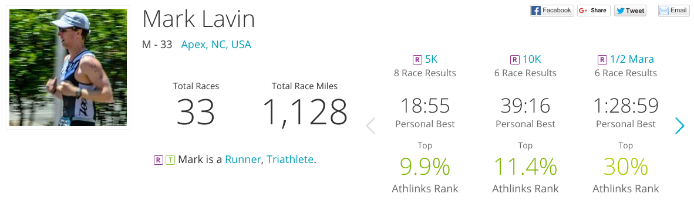
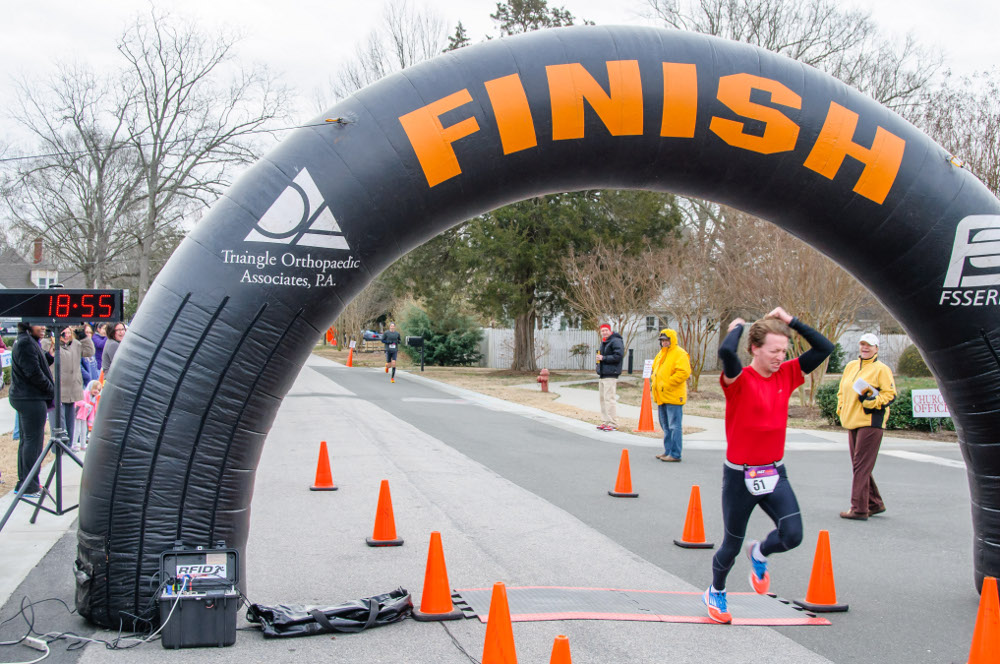
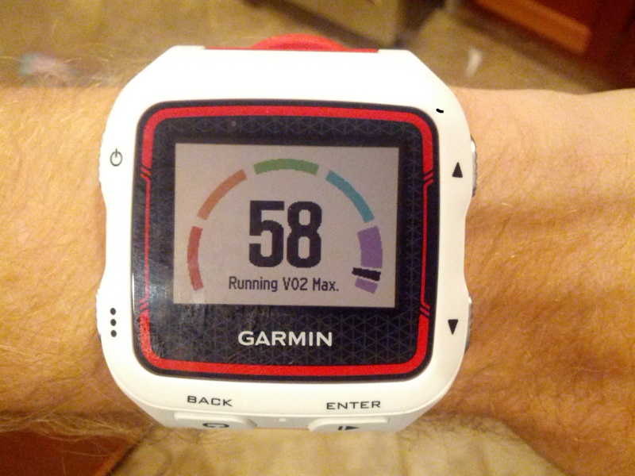
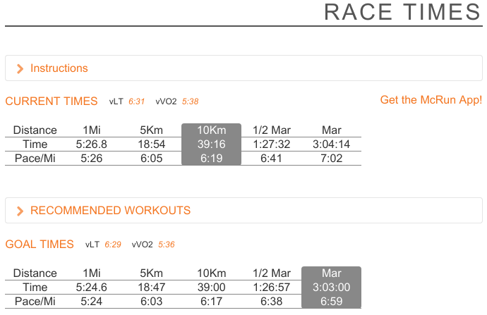
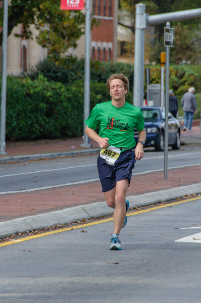
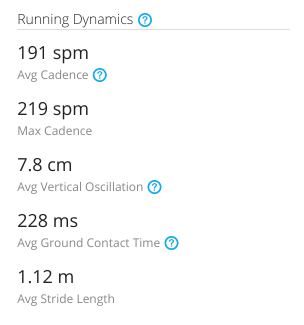

## The Science of Running

@@

Notes:
I'm Mark and I love to run. I'm good but not great. Certainly not an elite runner.
This talk isn't to make you love to run or even to tell you why I love it.
This talk won't make you a better runner but it can help you understand
what it takes to be a better runner or really many aerobic activities.

@@

Notes:
Whatever goal you have there are things which limit your ability to accomplish
those goals. Some of them are within our control and some of them are not.
Time, Money, Access, Location, Height/Weight/Age, etc. To get better at something
means learning what things are needed, which can be improved, and which
are easiest and/or most important to improve. Let's talk about key limiters
for running.

@@

## Oxygen

Notes:
Your body needs oxygen all of the time. The harder you work the more oxygen you
use. If you want to run far or fast you need to be very good at taking in
oxygen and delivering it to your muscles.

Notes:
There is a limit to how much oxygen your body can deliver. Some of this is determined
by genetics and there aren't any legal means to increase them (EPO, blood doping).
VO2 max is measured as ml of O2 per L of blood / kg of body weight.

Finding your VO2 Max needs to be done in a lab but there are easier estimations.
The Cooper Test uses the distance you can run (in meters) in 12 mins running all
out to estimate your V02 max. Warning: this sucks.

Notes:
The maximum amount of oxygen your body can deliver is one thing, but you also
care about how much it consumes. When your body uses more oxygen then in brings
in, you produce lactic acid (anaerobic resperation)

@@

## Water

Notes:
Your cells need water to convert ATP to energy. Even if you aren't sweating
you are using a lot of water. As you become dehydrated your body volume decreases
and you can't deliver oxygen which we were just talking about. Dehydration
is a slow decay of your pace.

However your body can only process so much water in an hour. On a hot day it's
almost impossible to keep up. I've lost 5+ lbs running for 1 1/2 hours before.

@@

## Calories

Notes:
A 140 lb runs burns approximately 100 calories per mile. 700-800/hr give or take
and over 2000 calories easily over the course of a marathon. Your body can store
(with training) 1500 or so plus whatever you eat before hand.

Calories come from stored sugar as well as body fat.

Notes:
The wall is when your body runs out of calories.
It's not like being dehydrated. Your body just slows to a crawl. It's like you
can't move. You have the will to move but your body doesn't listen.

@@

## Efficiency

Notes:
You can work around all of these limiters by being more efficient in your running.
Efficient running means little wasted movement: no swinging upper body, no bouncing,
no loud stomping with your feet. It means fast feet turning over quickly.

Notes:
Your pace is the number of steps you take in a minute * length of your stride
If you want to go faster you have to either: take more steps or longer steps
Many people try to take longer steps (without flexibility) and end up over-striding.
You want your feet to land more or less directly under you so you are probably
better off taking more steps until you hit a limit like 190+ spm.

191 spm * 1.12 m = 213.92 meters/min ~= 7.975 mph or a 7:30 pace

@@

Notes:
How do you use this to your advantage? Different workouts apply different stresses
to your body and your body adapts to the stress you apply to it.

## Run with Purpose

Notes:
If you want to improve your VO2 max you need to run hard but short intervals.
For your lactic threshold it's tempo runs which take a lot out of you.
You also need to recover. Know the purpose of your run and don't go too hard
or too easy. Run with purpose.

## Run Slower

Notes:
Your biggest gains are not on the top end (VO2 max/threshold) they are in running
efficiency and teaching your body to burn fat not sugar. For that you need to
run slow. At first it feels painfully slow but you'll be able to put in more
miles with less chance of getting hurt.

## Run More

Notes:
There aren't really any shortcuts. No frameworks to simplify the easy tasks
or the repetition. If you want results you have to put in the work.

@@

## Thanks!

http://talks.caktusgroup.com/lightning-talks/2015/running/

