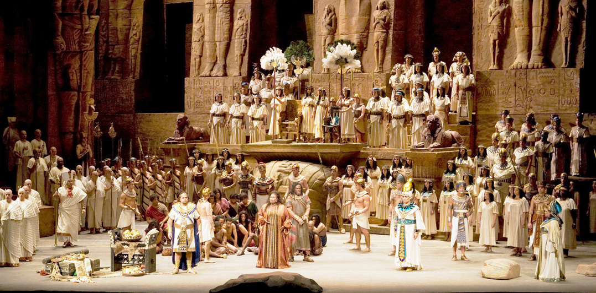

Integrating Designers Into Your Development Cycle
============================================================

Easing in
------------------------

David Ray

PyCarolinas 2012

Presenter Notes
---------------

* Case Study of Sorts

----

Talk Outline
------------

- Background
- Problem Space
- Toolset
- Rapid Prototyping
- Demo

----

Background
================

----

About Me
---------

- David Ray
- Developer at Caktus Consulting Group in Carrboro, NC

Presenter Notes
---------------

----

About Me
-------------------

- Performer
- Teacher

Presenter Notes
---------------
* Master's in Music
* Master's in HCID
* Come from a teaching family
* Interested in empowering others to be creative

----

Motivation
-------------------

- Create *safe* learning environments
- Earlier, closer engagement

Presenter Notes
---------------

----

Problem Space
================

----

3 Scenarios
-----------------------------------------

1 *"Traditional"* Designer / Design Cycle

  - Photoshop/Fireworks

Presenter Notes
---------------

* Prevalent in old school agencies/firms
* Inefficient
* Deliverables often not in VCS

----

3 Scenarios
-----------------------------------------

1 *"Traditional"* Designer / Design Cycle

  - Photoshop/Fireworks
  - Multiple Revisions

Presenter Notes
---------------

* Prevalent in old school agencies/firms
* Inefficient
* Deliverables often not in VCS

----

3 Scenarios
-----------------------------------------

1. *"Traditional"* Designer / Design Cycle

  - Photoshop/Fireworks
  - Multiple Revisions
  - **At some point** translate into Django templates

Presenter Notes
---------------

* Prevalent in old school agencies/firms
* Inefficient
* Deliverables often not in VCS

----

3 Scenarios
-----------------------------------------

2. Knowledgeable Designer / Front End Developer

Presenter Notes
---------------

* Has the depth and breadth of knowledge

----

3 Scenarios
-----------------------------------------

2. Knowledgeable Designer / Front End Developer

  - Rapid Prototyping

Presenter Notes
---------------

* Give them a spot to experiment,

----

3 Scenarios
-----------------------------------------

3. New-to-Django  Designer / Front End Developer

Presenter Notes
---------------

* In house, or maybe an external player
* Primary concern of this talk

----

3 Scenarios
-----------------------------------------

3. New-to-Django  Designer / Front End Developer

  - Interested in Django

Presenter Notes
---------------

----

3 Scenarios
-----------------------------------------

3. New-to-Django  Designer / Front End Developer

  - Interested in Django
  - Limited (or no) experience

Presenter Notes
---------------

----

Steep Learning Curve
---------------------------------

- Setup Development Environment
- Package Management
- Version Control
- Project Architecture

Presenter Notes
---------------

* Many moving parts
* Need to lower the barrier to entry
* Provide 'safer' ways to engage

----

Start small
---------------------------------------------

- Limit the scope of engagement

Presenter Notes
---------------

*

----

Not Big
---------------------------------------------

Photo: http://redoubtreporter.wordpress.com

Presenter Notes
---------------

* Don't throw them into the deep end

----

Fog of War
---------------------------------------------

.. image:: static/Fog_of_War.png
    :align: center
    :height: 425px

Photo: http://en.wikipedia.org/wiki/File:Fog_of_War.png

Presenter Notes
---------------

* Video Game Terminology: Unexplored areas remain hidden

----

What to limit?
================

----

Defining views
---------------------------------------------

::

    !python
    import os

    from django.conf import settings
    from django.shortcuts import redirect, render

    def comp_listing(request, directory_slug=None):
        """
    Output the list of HTML templates and subdirectories in the COMPS_DIR
    """
        context = {}
        working_dir = settings.COMPS_DIR
        if directory_slug:
            working_dir = os.path.join(working_dir, directory_slug)
        dirnames = []
        templates = []
        items = os.listdir(working_dir)
        templates = [x for x in items if os.path.splitext(x)[1] == '.html']
        dirnames = [x for x in items if \
                        not os.path.isfile(os.path.join(working_dir, x))]
        templates.sort()
        dirnames.sort()
        context['directories'] = dirnames
        context['templates'] = templates
        context['subdirectory'] = directory_slug
        return render(request, "comps/comp_listing.html", context)

Presenter Notes
---------------

* What is clear to you may be foreign to others

----

Defining views
---------------------------------------------

.. image:: static/heiroglyphics.jpg
    :align: center
    :height: 425px

Credit: http://www.flickr.com/photos/orinrobertjohn/2711348633/

Presenter Notes
---------------

* Regular Expressions.....

----

Defining urls
---------------------------------------------

::

    !python
    from django.conf.urls.defaults import patterns, url

    urlpatterns = patterns('comps.views',
        url(r'^comps(?:/(?P<directory_slug>[\w\-]+))?/$',
            'comp_listing',
            name='comp-listing'),
        url(r'^comps(?:/(?P<directory_slug>[\w\-]+))?/(?P<slug>[\w.\-]+)$',
            'comp',
            name='comp'),
        url(r'^export-comps/$',
            'export_comps',
            name='export-comps'),
    )

Presenter Notes
---------------

* Regular Expressions.....

----

Defining urls
---------------------------------------------

.. image:: static/regex.jpg
    :align: center

Presenter Notes
---------------

* Information Architecture may not even be planned out

----

Entry Point
================

----

Make it familiar
---------------------------------------------

- Use known skills & knowledge

Presenter Notes
---------------

----

Make it familiar
---------------------------------------------

- Use known skills & knowledge

  - HTML, CSS, JS

Presenter Notes
---------------

----

Make it familiar
---------------------------------------------

- Use known skills & knowledge

  - HTML, CSS, JS
  - Directory structures

Presenter Notes
---------------

----

Expand outward
---------------------------------------------

- Introduce conventions

Presenter Notes
---------------

----

Expand outward
---------------------------------------------

- Introduce conventions

::

    

Presenter Notes
---------------

----

Expand outward
---------------------------------------------

- Introduce conventions

::

    

Presenter Notes
---------------

----

Don't leave them hangin'
---------------------------------------------

- Provide docs
  - https://docs.djangoproject.com/en/dev/ref/templates/

Presenter Notes
---------------

* Django docs are a great reference

----

Toolchain
================

----

Django Comps
-------------------------------------------------

- Provides an entry point for deeper integration of front end designers with little to no experience into a project.

::

    templates/
    |-- comps
    |   |-- comp1.html
    |   |-- comp2.html
    |-- app1
    |-- app2
    |-- base.html

----

Benefits
------------------------------------------------

- Work within the actual Django project

----

Benefits
------------------------------------------------

- Work within the actual Django project
- Work in parallel

----

Benefits
------------------------------------------------

- Work within the actual Django project
- Work in parallel
- Utilize version control

----

Benefits
------------------------------------------------

- Work within the actual Django project
- Work in parallel
- Utilize version control
- Feedback loops are faster

----

Benefits
------------------------------------------------

- Work within the actual Django project
- Work in parallel
- Utilize version control
- Feedback loops are faster
- Provide a safe place for them to experiment

----

Benefits
------------------------------------------------

- Work within the actual Django project
- Work in parallel
- Utilize version control
- Feedback loops are faster
- Provide a safe place for them to experiment
- Work at their own pace

----

Django Project Templates
-------------------------------------------------

- Django 1.4 supports scaffolding projects from templates
- Quantify and define defaults

  - Deployment scripts via Fabric
  - Vagrant config

----

Fabric
---------------------------------

**What is it?**

- A tool that lets you execute **arbitrary Python functions** via the **command line**
- A library of subroutines (built on top of a lower-level library) to make executing shell commands over SSH **easy** and **Pythonic**.

Presenter Notes
---------------

----

Fabric
----------------------------------

**Sample**

::

    !python
    def hello():
        print("Hello world!")

::

    $ fab hello
    Hello world!

    Done.

Presenter Notes
---------------

----

VirtualBox
---------------------------------

.. image:: static/virtualbox.png
    :align: center

**What is it?**

- virtualization software

Presenter Notes
---------------

----

Vagrant
---------------------------------

.. image:: static/vagrant.png
    :align: center
    :height: 350px

Presenter Notes
---------------

----

Vagrant
---------------------------------

**Why use it?**

- Developers no longer need to worry about setting up complicated infrastructure components.
- Operations engineers no longer need to worry about developers having a different local setup from production.

Presenter Notes
---------------

----

Rapid Prototyping
==================

----

Rapid Prototyping
------------------------------------------

- Organic side effect
- Inspired feature enhancements

  - Output rendered HTML for distribution

    - zipfile export
    - management command

----

Demo
================

----

Resources
------------------

- http://virtualbox.org
- http://vagrantup.com/
- http://docs.fabfile.org/
- https://github.com/caktus/django-project-template/zipball/master
- https://github.com/daaray/django-comps

----

The End
-------

- **Slides:** http://talks.caktusgroup.com/pycarolinas/2012/integrating-designers
- David Ray - @david_codes / dray@caktusgroup.com

