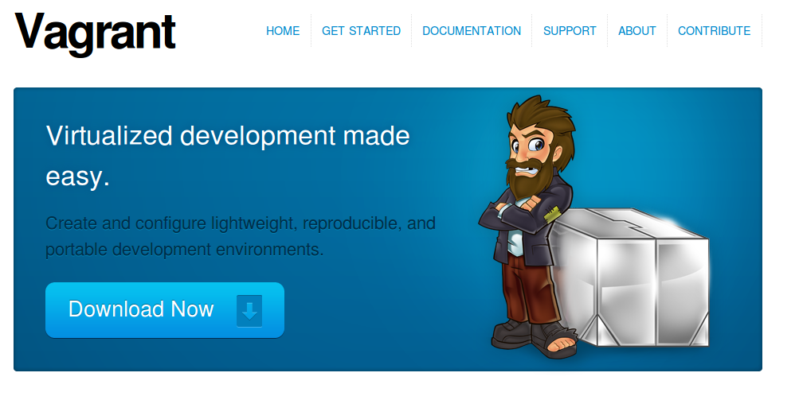

## Integrating Designers Into Your Development Cycle
Caktus Group - PyCarolinas 2012

Notes:

  - Case Study of Sorts

@@

## Talk Outline

- Background
- Problem Space
- Toolset
- Rapid Prototyping
- Demo

@@

## About Me

 <!-- .element: style="float: left" -->

- Caktus Developer & Sales Engineer
- Operatic Tenor
- Teacher

Notes:

* Master's in Music
* Master's in HCID
* Come from a teaching family
* Interested in empowering others to be creative

@@

## Motivation

- Create *safe* environments for

  - learning
  - creating

- Foster engagement

Notes:

* Earlier & closer

@@

## Problem Space

- Scenario 1
  - *"Traditional"* Designer / Design Cycle <!-- .element: class="fragment" data-fragment-index="1" -->
  - Photoshop/Fireworks <!-- .element: class="fragment" data-fragment-index="2" -->
  - Multiple Revisions <!-- .element: class="fragment" data-fragment-index="3" -->
    - **At some point** translate into Django templates <!-- .element: class="fragment" data-fragment-index="4" -->

Notes:

* Prevalent in old school agencies/firms
* Inefficient
* Deliverables often not in VCS

@@

## Problem Space

- Scenario 2
  - Knowledgeable Designer / Front End Developer <!-- .element: class="fragment" data-fragment-index="1" -->
  - Rapid Prototyping <!-- .element: class="fragment" data-fragment-index="2" -->

Notes:

* Has the depth and breadth of knowledge
* Give them a spot to experiment,

@@

## Problem Space

- Scenario 3
  - New-to-Django  Designer / Front End Developer <!-- .element: class="fragment" data-fragment-index="1" -->
  - Interested in Django <!-- .element: class="fragment" data-fragment-index="2" -->
  - Limited (or no) experience <!-- .element: class="fragment" data-fragment-index="3" -->


Notes:

* In house, or maybe an external player
* Primary concern of this talk


@@

## Steep Learning Curve

- Setup Development Environment <!-- .element: class="fragment" data-fragment-index="1" -->
- Package Management <!-- .element: class="fragment" data-fragment-index="2" -->
- Project Architecture <!-- .element: class="fragment" data-fragment-index="3" -->
- Version Control <!-- .element: class="fragment" data-fragment-index="4" -->

Notes:

* Many moving parts
* Need to lower the barrier to entry
* Provide 'safer' ways to engage

@@

## Start Small

- Limit the scope of engagement

Notes:


@@

## Not Big


Photo: http://redoubtreporter.wordpress.com


Notes:

* Don't throw them into the deep end

@@

## Fog of War


Photo: http://en.wikipedia.org/wiki/File:Fog_of_War.png


Notes:

* Video Game Terminology: Unexplored areas remain hidden


@@

## What to limit?

@@

## Defining Views

```
    import os

    from django.conf import settings
    from django.shortcuts import redirect, render

    def comp_listing(request, directory_slug=None):
        """
    Output the list of HTML templates and subdirectories in the COMPS_DIR
    """
        context = {}
        working_dir = settings.COMPS_DIR
        if directory_slug:
            working_dir = os.path.join(working_dir, directory_slug)
        dirnames = []
        templates = []
        items = os.listdir(working_dir)
        templates = [x for x in items if os.path.splitext(x)[1] == '.html']
        dirnames = [x for x in items if \
                        not os.path.isfile(os.path.join(working_dir, x))]
        templates.sort()
        dirnames.sort()
        context['directories'] = dirnames
        context['templates'] = templates
        context['subdirectory'] = directory_slug
        return render(request, "comps/comp_listing.html", context)
```

Notes:

* What is clear to you may be foreign to others

@@

## Defining Views


Credit: http://www.flickr.com/photos/orinrobertjohn/2711348633/


Notes:

* Regular Expressions.....


@@

## Defining Urls

```
    from django.conf.urls.defaults import patterns, url

    urlpatterns = patterns('comps.views',
        url(r'^comps(?:/(?P<directory_slug>[\w\-]+))?/$',
            'comp_listing',
            name='comp-listing'),
        url(r'^comps(?:/(?P<directory_slug>[\w\-]+))?/(?P<slug>[\w.\-]+)$',
            'comp',
            name='comp'),
        url(r'^export-comps/$',
            'export_comps',
            name='export-comps'),
    )
```
Notes:

@@

## Defining Urls


Notes:

* Information Architecture may not even be planned out


@@

## Entry Point


@@

## Make it familiar

- Use known skills & knowledge <!-- .element: class="fragment" data-fragment-index="1" -->

  - HTML, CSS, JS <!-- .element: class="fragment" data-fragment-index="2" -->
  - Directory structures <!-- .element: class="fragment" data-fragment-index="3" -->

Notes:

@@

## Expand Outward

- Introduce conventions

```
    
    
```

@@ Don't leave them 'hangin'

- Provide docs
  - https://docs.djangoproject.com/en/dev/ref/templates/

Notes:

* Django docs are a great reference


@@

## Toolchain

@@

## Django Comps


- Provides an entry point for deeper integration of front end designers with little to no experience into a project.

```
    templates/
    |-- comps
    |   |-- comp1.html
    |   |-- comp2.html
    |-- app1
    |-- app2
    |-- base.html
```

@@

## Benefits

- Work within the actual Django project <!-- .element: class="fragment" data-fragment-index="1" -->
- Work in parallel <!-- .element: class="fragment" data-fragment-index="2" -->
- Utilize version control <!-- .element: class="fragment" data-fragment-index="3" -->
- Feedback loops are faster <!-- .element: class="fragment" data-fragment-index="4" -->
- Provide a safe place for them to experiment <!-- .element: class="fragment" data-fragment-index="5" -->
- Work at their own pace <!-- .element: class="fragment" data-fragment-index="6" -->

@@

## Django Project Templates

- Django 1.4 supports scaffolding projects from templates
- Quantify and define defaults

  - Deployment scripts via Fabric
  - Vagrant config

@@

## Fabric

**What is it?**

- A tool that lets you execute **arbitrary Python functions** via the **command line**
- A library of subroutines (built on top of a lower-level library) to make executing shell commands over SSH **easy** and **Pythonic**.

@@

## Fabric

**Sample**

```
    def hello():
        print("Hello world!")

    $ fab hello
    Hello world!

    Done.
```

@@

## VirtualBox


**What is it?**

- virtualization software

@@

## Vagrant



@@

## Vagrant

**Why use it?**

- Developers no longer need to worry about setting up complicated infrastructure components.
- Operations engineers no longer need to worry about developers having a different local setup from production.

@@

## Rapid Prototyping

- Organic side effect
- Inspired feature enhancements

  - Output rendered HTML for distribution

    - zipfile export
    - management command

@@

## Demo

@@

## Resources

- http://virtualbox.org
- http://vagrantup.com/
- http://docs.fabfile.org/
- https://github.com/caktus/django-project-template/zipball/master
- https://github.com/daaray/django-comps

@@

## The End

- **Slides:** http://talks.caktusgroup.com/pycarolinas/2012/integrating-designers
- David Ray - @david_codes / dray@caktusgroup.com


