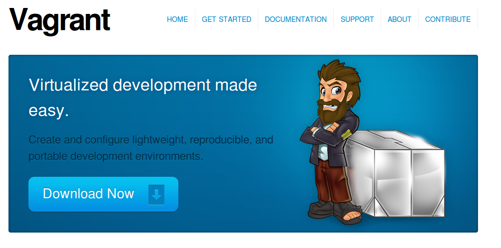

Integrating Designers Into Your Development Cycle
============================================================

Disrupting tradition and lowering the barrier to entry
----------------------------------------------------------------------------------------------------

David Ray

PyCarolinas 2012

Presenter Notes
---------------

----

Talk Outline
------------

- Background
- Challenges
- Toolset
- Rapid Prototyping
- Demo

----

Background
================

----

About Me
---------

- David Ray
- Developer at Caktus Consulting Group in Carrboro, NC

Presenter Notes
---------------

----

About Me
-------------------

- Performer
- Teacher

Presenter Notes
---------------
* Master's in Music
* Master's in HCID
* Come from a teaching family
* Interested in empowering others to be creative

----

Motivation
-------------------

- Streamline interactions
- Create *safe* learning environments
- Closer engagement

Presenter Notes
---------------

----

Challenges
================

----

Traditional Design Phase
-----------------------------------------

- Design in a silo

  - Photoshop/Fireworks
  - Multiple Revisions
  - Translate into Django templates

Presenter Notes
---------------

* Prevalent in old school agencies/firms
* Inefficient
* Deliverables often not in VCS

----

Steep Learning Curve
---------------------------------

- Setup Development Environment
- Package Management
- Version Control
- Project Architecture

Presenter Notes
---------------

* Many moving parts
* Need to lower the barrier to entry
* Provide 'safer' ways to engage

----

Toolset
================

----

VirtualBox
---------------------------------

**What is it?**

- virtualization software

Presenter Notes
---------------

----

Vagrant
---------------------------------

Presenter Notes
---------------

----

Vagrant
---------------------------------

**Why use it?**

- Developers no longer need to worry about setting up complicated infrastructure components.
- Operations engineers no longer need to worry about developers having a different local setup from production.

Presenter Notes
---------------

----

Fabric
---------------------------------

**What is it?**

* A tool that lets you execute **arbitrary Python functions** via the **command line**
* A library of subroutines (built on top of a lower-level library) to make executing shell commands over SSH **easy** and **Pythonic**.

Presenter Notes
---------------

----

Fabric
----------------------------------

**Sample**

::

    !python
    def hello():
        print("Hello world!")

::

    $ fab hello
    Hello world!

    Done.

Presenter Notes
---------------

----

Django Project Templates
-------------------------------------------------

- Django 1.4 supports scaffolding projects from templates
- Quantify and define defaults
  - Deployment scripts via Fabric
  - Vagrant config

----

Django Comps
-------------------------------------------------

- Provides an entry point for deeper integration of front end designers with little to no experience into a project.

::

    -- templates
    ---- comps
    ---- app1
    ---- app2
    ---- base.html

----

Benefits
------------------------------------------------

- Work within the actual Django project
- Utilize version control
- Feedback loops are faster
- Provide a safe place for them to experiment
- Work at their own pace

----

Rapid Prototyping
==================

----

Rapid Prototyping
------------------------------------------

- Organic side effect
- Inspired feature enhancements

  - Output rendered HTML for distribution

    - zipfile export
    - management command

----

Demo
================

----

Resources
------------------

- http://virtualbox.org
- http://vagrantup.com/
- http://docs.fabfile.org/
- https://github.com/caktus/django-project-template/zipball/master
- https://github.com/daaray/django-comps

----

The End
-------

- **Slides:** http://talks.caktusgroup.com/pycarolinas/2012/integrating_designers_into_dev_cycle
- David Ray - @david_codes / dray@caktusgroup.com

