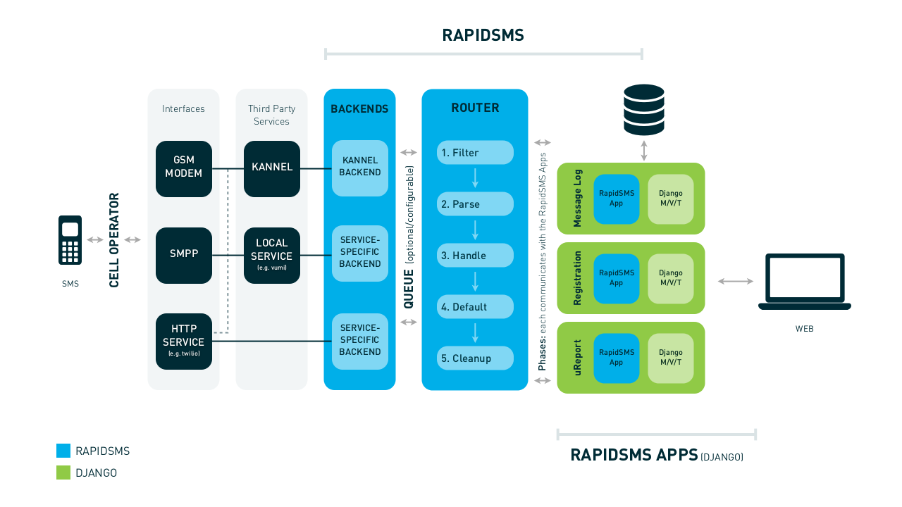

## Building SMS Applications with Django
Caktus Group - PyCon 2015

@@

## Today's Presenters

- Caleb Smith
- Mark Lavin
- David Ray

@@

## Caleb Smith


- Astro Code School Lead Instructor
- Former Caktus Developer
- Music Theorist

@@

## Mark Lavin


- Caktus Technical Director
- Triathlete
- Beer Enthusiast

@@

## David Ray


- Caktus Developer & Sales Engineer
- Operatic Tenor
- ***Not*** a triathlete

@@

## Outline

- What is RapidSMS?
- Why RapidSMS?
- Application Walkthrough
- Next Steps

@@

## What is RapidSMS?

- Collection of tools that extend Django to support processing SMS texts  <!-- .element: class="fragment" data-fragment-index="1" -->
  - Application Framework  <!-- .element: class="fragment" data-fragment-index="2" -->
  - Pluggable Backends  <!-- .element: class="fragment" data-fragment-index="3" -->
  - Documentaion & Sample Applications  <!-- .element: class="fragment" data-fragment-index="4" -->

Notes:

- Framework for writing code to be invoked when a text message is received and respond to it
- NEXT FRAGMENT
- Backend required as there's no universal standard for sending and receiving text messages over the Internet.
- Often we get access to the messages via a third party vendor, like Twilio or Tropo, that provides a proprietary interface
- RapidSMS isolates us from the differences among vendors.
- NEXT FRAGMENT

@@

## Why RapidSMS?

- Built on Django  <!-- .element: class="fragment" data-fragment-index="1" -->
- Open Source (BSD License)  <!-- .element: class="fragment" data-fragment-index="2" -->
- Vendor Neutral  <!-- .element: class="fragment" data-fragment-index="3" -->

Notes:

- Django: In our wheelhouse
- NEXT FRAGMENT
- BSD: Free to use, extend, give back to the larger community
- NEXT FRAGMENT
- Dev our applications without being tied to any particular vendor of text messaging services.
  - Don't have to pick a vendor before we can start.
  - Change vendors in the future without having to rewrite the applications.
  - Deploy applications to different countries that might not have any common vendor for messaging services.

@@

## RapidSMS Structure



Notes:

- Gateway
  - The gateway acts as a relay, translating one protocol into another
- Backend
  - Defines how RapidSMS communicates with the outside world
    - Incoming messages via HTTP, processed by Router
    - Outgoing messages sent via HTTP
    - Kannel (USB or serial GSM Modem)
    - Vumi (SMPP short message peer to peer)
    - HTTP (powers Kannel and Vumi)
    - Database (testing)
  - Custom (rapidsms-twilio)
- Router:
  - Messaging processing component
  - It provides the infrastructure and defines the workflow to receive, process and send text messages.
    - Blocking (synchronous)
    - Celery (async)
    - Database (queues in DB but uses Celery for async)
  - Incoming messages are processed in 5 phases; each providing application hooks
- Application:
  - Provides custom logic for processing incoming and outgoing messages; aligns
    with Router phases

@@

## Application Structure

```
project
+-- myapp
|   +-- templates
|   +-- app.py
|   +-- models.py
|   +-- views.py
```

Notes:

 - Contained in a Django
 - Extends rapidsms.apps.base.AppBase in app

@@

## Sample App

```
from rapidsms.apps.base import AppBase

class SpamFilter(AppBase):

    def filter(self, msg):
        """Filter out spam messages."""
        if msg.text == "Congratulations, you've won a free iPod!":
            return True  # This message is probably spam and should not be
                         # processed any more.
        return False
```

Notes:

 - Filters spam messages from any further processing by any app

@@

## Processing Phases

- <!-- .element: class="fragment" data-fragment-index="1" --> **filter:** *abort further processing*
- <!-- .element: class="fragment" data-fragment-index="2" --> **parse:** *globally modify message*
- <!-- .element: class="fragment" data-fragment-index="3" --> **handle:** *respond to the incoming message*
- <!-- .element: class="fragment" data-fragment-index="4" --> **default:** *default action if **NO** app handle returns*
- <!-- .element: class="fragment" data-fragment-index="5" --> **cleanup:** *perform any needed cleanup from prior phases*

@@

## Handlers Contrib App

```
LIGHT ON
```

```
1 plus 2
```

Notes:

- Many SMS apps are keyword  or pattern based
- Contrib app available to bootstrap keyword and pattern based apps

@@

## KeywordHandler

```
from rapidsms.contrib.handlers import KeywordHandler

class LightHandler(KeywordHandler):
    keyword = "light"

    def help(self):
        self.respond("Send LIGHT ON or LIGHT OFF.")

    def handle(self, text):
        if text.upper() == "ON":
            self.respond("The light is now turned on.")
        elif text.upper() == "OFF":
            self.respond("Thanks for turning off the light!")
        else:
            self.help()
```

@@

## PatternHandler

```
from rapidsms.contrib.handlers import PatternHandler

class SumHandler(PatternHandler):
    pattern = r"^(\d+) plus (\d+)$"

    def handle(self, a, b):
        a, b = int(a), int(b)
        total = a + b
        self.respond("%d + %d = %d" % (a, b, total))
```
