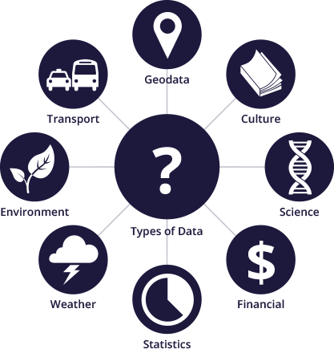
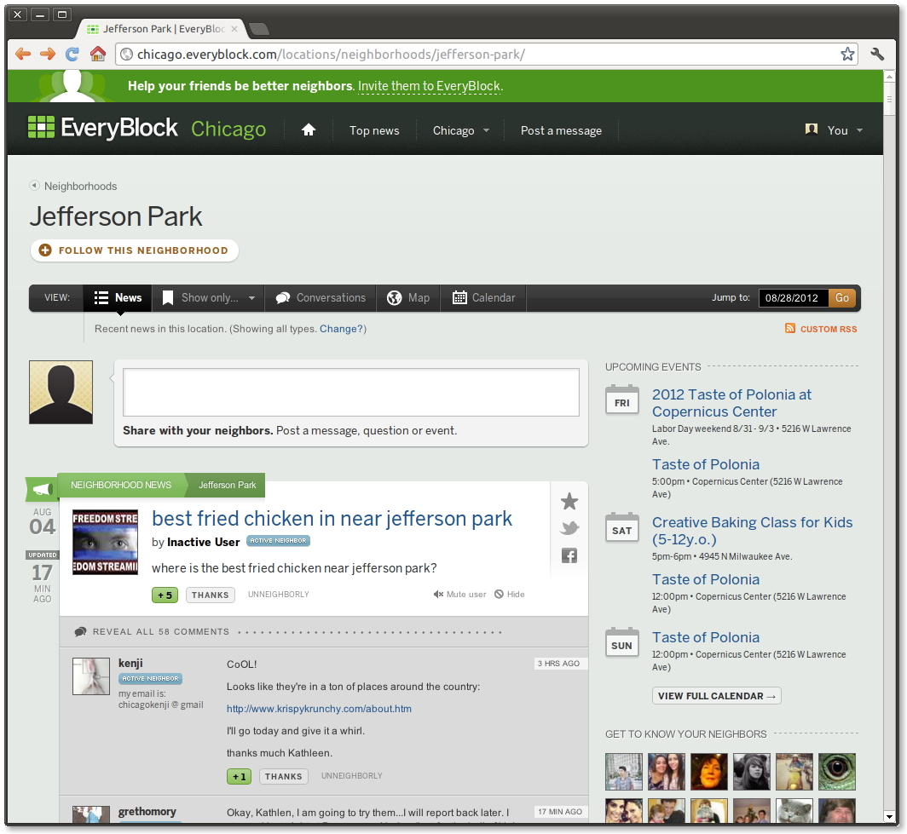

=========
Open Data
=========

Colin Copeland

----

Talk Outline
============

- What is Open Data?
- ...

----

What is Open Data?
==================

**Open Knowledge Foundation Definition**

Open data is data that can be freely used, reused and redistributed by anyone – subject only, at most, to the requirement to attribute and sharealike.

**Use in the government/public sector (from Socrata)**

Making data that belongs to the public broadly accessible and usable by humans and machines, free of any constraints.

Presenter Notes
---------------

- I'm not going to dive deep into the philosophical aspects of open data
- Talk about it at a very high level

----

Historic Example: Weather
=========================

**Weather**

Data from government satellites and groud stations.

Created industry for:

* Weather Channel
* Commercial agricultural advisory services
* New insurance options

Presenter Notes
---------------

- Economy has consistently benefited when government data have been released to entrepreneurs and other innovators.

----

Historic Example: GPS
=====================

**Global Positioning System (GPS)**

US Gov. released GPS data once reserved for military use to the public.

Gave rise to GPS-powered innovations:

* Aircraft navigation systems
* Precision farming
* Location-based apps

Presenter Notes
---------------

- Executive decisions made by Presidents Ronald Reagan and Bill Clinton
- Turns your phone into a GPS device so you can use Foursquare or get navigation directions on a map.

----

Open Data Requirements
======================

- Availability and Access
- Reuse and Redistribution
- Universal Participation

Presenter Notes
---------------

- Release important government data allows citizen developers and entrepreneurs to turn them into new products and services
- Available online and in a convenient and modifiable form
- Released under terms that allow reuse, redistribution and mixing with ther data sets
- Everyone can do it, no restrictions, non-commercial/education-only. Don't need to worry about the legal aspects.

----

Interoperability
================

Presenter Notes
---------------

- Requirements are really about interoperability, right?
- Open formats (nothing proprietary)
- GPS data and transportation alone is great
- But the data becomes more useful when combined together
- Open data can scale too. Shared formats, combining data across regions, etc.
- Larger level, more people

----

What kind of data?
==================

Source: http://okfn.org/opendata/

Presenter Notes
---------------

- Data that the government already collects
- Map data (roads, buildings, topography and boundaries)
- Environment (level of pollutants, quality of rivers and seas)
- Statistical and Financial data (census and government spending)
- Anything from prices charged by hospitals/colleges to crime to unemployment

----

Not Personal Data
=================

**Important point:** not personally identifiable data

Presenter Notes
---------------

- Not talking about releasing personal tax records or private health records
- This means that some data is aggregate data, to a certain area/region, over time, etc.
- Scrubbing data talked about later

Now, we may see even more life-changing technologies as a result of open government data. Last week, the White House released an executive order that makes “open and machine readable” the new default for the release of government information. Although people who care about open data were generally quite excited, the news barely made an impression on the general public. But it should: This is perhaps the biggest step forward to date in making government data—that information your tax dollars pay for—accessible for citizens, entrepreneurs, politicians, and others.

----

What is OpenBlock?
------------------

- "Hyper-local news" application framework

- Example news types

  - police incident reports
  - property transactions
  - restaurant inspections
  - business registrations

- Open source project

  - Web site: http://openblockproject.org/
  - Code: https://github.com/openplans/openblock
  - Mailing list: http://groups.google.com/group/ebcode/

----

EveryBlock.com
--------------

Presenter Notes
---------------

- Browse by neighborhoods, streets, zipcodes, or draw your own location
- Lots of public record information as well as community neighbor content
- Lots of community activity, especially in Chicago

.. 
.. 
.. prices charged by colleges

.. help agencies share data internally

.. transport
.. geodata
.. statistics
.. financial
.. government spending
.. educational outcomes

.. more data
.. business and communities want to share back their data

..

.. data as a commoddity

.. White House
.. http://project-open-data.github.io/
.. Data Portals
.. https://data.raleighnc.gov/
.. http://www.opendataphilly.org/
.. Open Rural
.. http://columbusco-staging.openrural.org/
.. Events
.. NC Data Jam
.. Datapalooza
.. Scraper Wiki
.. NC Secretary of State Corporation Filings
.. Columbus County NC Property Sales
.. NC Restaurant Inspections
.. Code for America
.. Durham Brigade
.. Open Data Resolution
