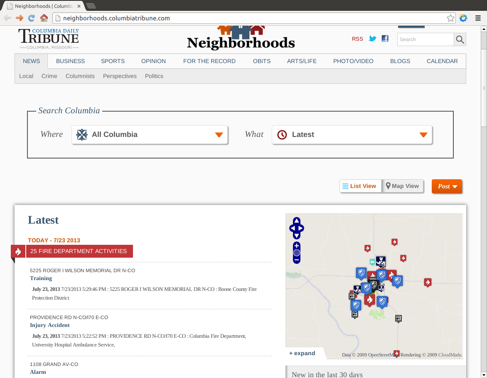
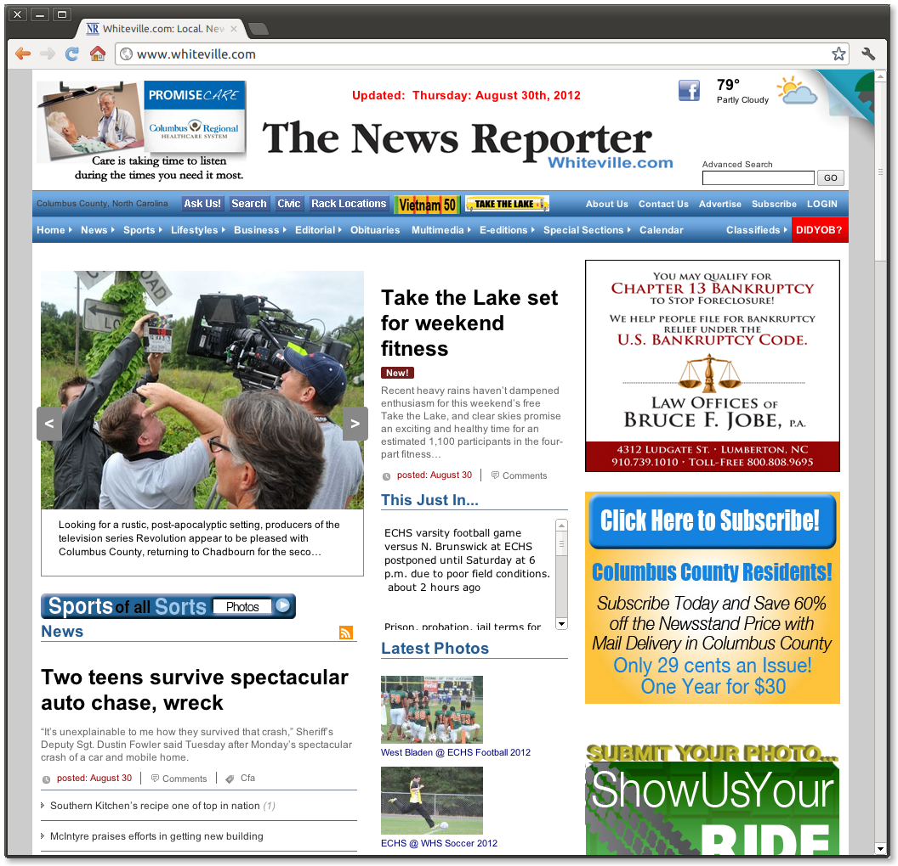
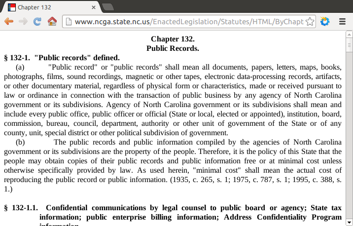

=========
Open Data
=========

Colin Copeland

http://cakt.us/tripython-opendata

----

Talk Outline
============

- About me
- What is Open Data?
- ...

----

About Me
========

* Work here at Caktus - we build custom Python/Django web apps
* In spare time have picked up open data as a hobby
* Citizen and programmer/developer perspective

----

What is Open Data?
==================

**Open Knowledge Foundation Definition**

Open data is data that can be freely used, reused and redistributed by anyone – subject only, at most, to the requirement to attribute and sharealike.

**Use in the government/public sector (from Socrata)**

Making data that belongs to the public broadly accessible and usable by humans and machines, free of any constraints.

Presenter Notes
---------------

- I'm not going to dive deep into the philosophical aspects of open data
- Talk about it at a very high level

----

Historic Example: Weather
=========================

**Weather**

Data from government satellites and groud stations.

Created industry for:

* Weather Channel
* Commercial agricultural advisory services
* New insurance options

Presenter Notes
---------------

- Two commonly mentioned examples of how open data has been used in the past
- Economy has consistently benefited when government data have been released to entrepreneurs and other innovators.

----

Historic Example: GPS
=====================

**Global Positioning System (GPS)**

US Gov. released GPS data once reserved for military use to the public.

Gave rise to GPS-powered innovations:

* Aircraft navigation systems
* Precision farming
* Location-based apps

Presenter Notes
---------------

- Executive decisions made by Presidents Ronald Reagan and Bill Clinton
- Turns your phone into a GPS device so you can use Foursquare or get navigation directions on a map.

----

Open Data Requirements
======================

- Availability and Access
- Reuse and Redistribution
- Universal Participation

Presenter Notes
---------------

- Release important government data allows citizen developers and entrepreneurs to turn them into new products and services
- Available online and in a convenient and modifiable form
- Released under terms that allow reuse, redistribution and mixing with ther data sets
- Everyone can do it, no restrictions, non-commercial/education-only. Don't need to worry about the legal aspects.

----

Interoperability
================

Presenter Notes
---------------

- Requirements are really about interoperability, right?
- Open formats (nothing proprietary)
- GPS data and transportation alone is great
- But the data becomes more useful when combined together
- Open data can scale too. Shared formats, combining data across regions, etc.
- Larger level, more people

----

What kind of data?
==================

.. image:: static/data-types.png
  :align: center

Source: http://okfn.org/opendata/

Presenter Notes
---------------

- Data that the government already collects
- Map data (roads, buildings, topography and boundaries)
- Environment (level of pollutants, quality of rivers and seas)
- Statistical and Financial data (census and government spending)
- Anything from prices charged by hospitals/colleges to crime to unemployment

----

Not Personal Data
=================

**Important point:** not personally identifiable data

Issues in the past: Journal News, Westchester County, NY, published map with names and addresses of people who had gun permits

http://www.nytimes.com/2013/01/14/business/media/guns-maps-and-disturbing-data.html

Presenter Notes
---------------

- Not talking about releasing personal tax records or private health records. Gave open data a bad rap. Other ways to analyze this data without mapping everyone to a point.
- This means that some data is aggregate data, to a certain area/region, over time, etc.
- Scrubbing data talked about later
- Let's look at an example of using open data

----

EveryBlock.com
==============

Presenter Notes
---------------

- Hyper local news
- Browse by neighborhoods, streets, zipcodes, or draw your own location
- Lots of public record information as well as community neighbor content
- Lots of community activity, especially in Chicago

----

OpenBlock
=========

.. image:: ../../djangocon/2012/openblock/static/openblock-logo.png
    :align: center

- "Hyper-local news" application framework
- Example news types
    - police incident reports
    - property transactions
    - restaurant inspections
    - business registrations
- Open source project
    - Web site: http://openblockproject.org/
    - Code: https://github.com/openplans/openblock

----

Columbia Tribune
================

Presenter Notes
---------------

- Most recently in Columbia Missouri, newspaper
- Police, restaurants and home sales are the newsy stuff that's updated daily

----

OpenRural
=========

Presenter Notes
---------------

- Taking OpenBlock and using it in rural North Carolina communities
- Small towns and small news organizations
- Newspapers don't have a lot of digitial resources
- And they lack the resources to make public data digestible on the web
- Quite different than typical OpenBlock setup in a big city with larger infrastructure

----

OpenRural
=========

.. http://www.knightfoundation.org/grants/20110150/

.. image:: ../../djangocon/2012/openblock/static/unc.png
    :width: 60%
    :align: center

- **June 2011:** OpenRural funded by a three-year Knight News Challenge grant
- Ryan Thornburg, professor at School of Journalism and Mass Communication at UNC
- Caktus is helping develop and deploy OpenRural for these NC communities

Presenter Notes
---------------

- Goals:

  - Apply same OpenBlock tools to rural North Carolina communities
  - Increase access to local public records
  - Do this by helping local newspapers leverage OpenBlock
  - "Help Rural Newspapers Get Access to Public Data"

----

Columbus County, North Carolina
===============================

.. image:: ../../djangocon/2012/openblock/static/nc-columbus-county.png
    :width: 100%

Presenter Notes
---------------

- Our initial focus is on Columbus County, NC
- Small county in the south eastern part of the state with 50k residents
- Working with a local newspaper to incorporate public records onto their site

----

The News Reporter
=================

Presenter Notes
---------------

- The online version of the paper serving Whiteville and Columbus County

----

Columbus County Open Data
=========================

.. image:: static/columbus-gis.png
    :width: 100%

Presenter Notes
---------------

- Wouldn't have been possible without the county staff
- Access to downloadable information from local websites
- Small county, CH is bigger, one guy
- People asking him for data, rather than responding to each one individually, he posts them online

----

Durham Streetcars
=================

.. image:: static/streetcars.jpg
    :width: 100%

Source: http://www.opendurham.org/buildings/607-611-east-main-street-streetcar-and-bus-garage

Presenter Notes
---------------

- Bring this back to the Triangle, maybe do something in Durham
- GIS/Historic nut
- Durham had horse/mule drawn streetcars in 1880. Electric streetcars 1900-1930, before busses took over.

----

Durham GIS
==========

.. image:: static/durham-gis.png
    :width: 100%

Presenter Notes
---------------

- Can't download
- $25-$100/layer

----

Commercial Use
==============

* "None of the GIS data purchased through this Policy shall be published by the requestor **without the City’s explicit written consent**, nor shall the requestor permit any other party to publish the data."
* $100-$1000/layer
* Provided on CD-ROM or 8MM tape

Presenter Notes
---------------

- Poking fun at Durham
- Recoup the costs of man hours spent creating these files
- Rather than finding common set of files to publish, they make all requests go through the department
- GIS has a special case in NC

----

Statute 132 - Public Records
============================

http://www.ncga.state.nc.us/EnactedLegislation/Statutes/HTML/ByChapter/Chapter_132.html

Presenter Notes
---------------

- Enacted legislation in NC for public records
- Lays out what can be published
- Has special case for GIS

----

Open Data Triangle
==================

* Cary Open Day
* NC DataPalooza (http://ncdatapalooza.com/) - Todd Park (US CTO)
* Triangle Code for America (http://www.meetup.com/Triangle-Code-for-America/)
* Raleigh Open Data Manager - Jason Hare

Presenter Notes
---------------

* Lots going on in the triangle
* DataPalooza is an open-data competition sponsored by the White House - focused on health, energy and education data

----

Raleigh Open Data
=================

.. image:: static/openraleigh.png
    :width: 100%

Presenter Notes
---------------

- Socrata data portal
- 95 data sets
- Jason says it's getting a lot of hits and they're getting requests for different kinds of data

----

OpenDataPhilly
==============

.. image:: static/opendataphilly.png
    :width: 100%

Presenter Notes
---------------

- Take the ODP codebase and use it in Durham
- Python/Django codebase, I can deploy this here
- Got it up and running, but Durham wasn't ready to adpot it

----

Code for America Brigade
========================

Presenter Notes
---------------

- CfA Brigade, organizing civic-minded technologists to contribute their skills in service to their local governments
- Create re-usable apps
- Durham started in May. Small steps, slowly working to pass an open data resolution.

.. Now, we may see even more life-changing technologies as a result of open government data. Last week, the White House released an executive order that makes “open and machine readable” the new default for the release of government information. Although people who care about open data were generally quite excited, the news barely made an impression on the general public. But it should: This is perhaps the biggest step forward to date in making government data—that information your tax dollars pay for—accessible for citizens, entrepreneurs, politicians, and others.

.. prices charged by colleges
.. help agencies share data internally
.. data as a commoddity

.. White House
.. http://project-open-data.github.io/
.. Data Portals
.. https://data.raleighnc.gov/
.. http://www.opendataphilly.org/
.. Open Rural
.. http://columbusco-staging.openrural.org/
.. Events
.. NC Data Jam
.. Datapalooza
.. Scraper Wiki
.. NC Secretary of State Corporation Filings
.. Columbus County NC Property Sales
.. NC Restaurant Inspections
.. Code for America
.. Durham Brigade
.. Open Data Resolution
